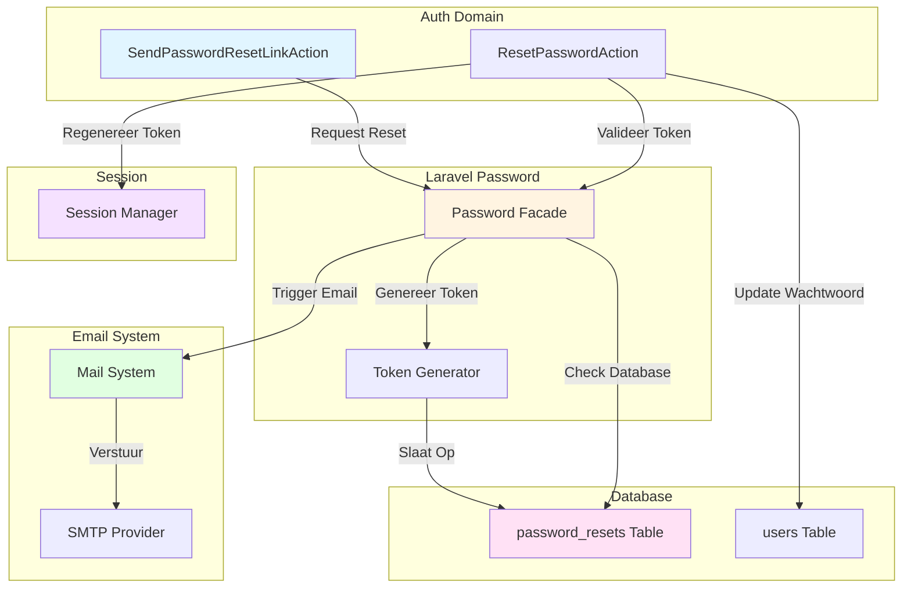
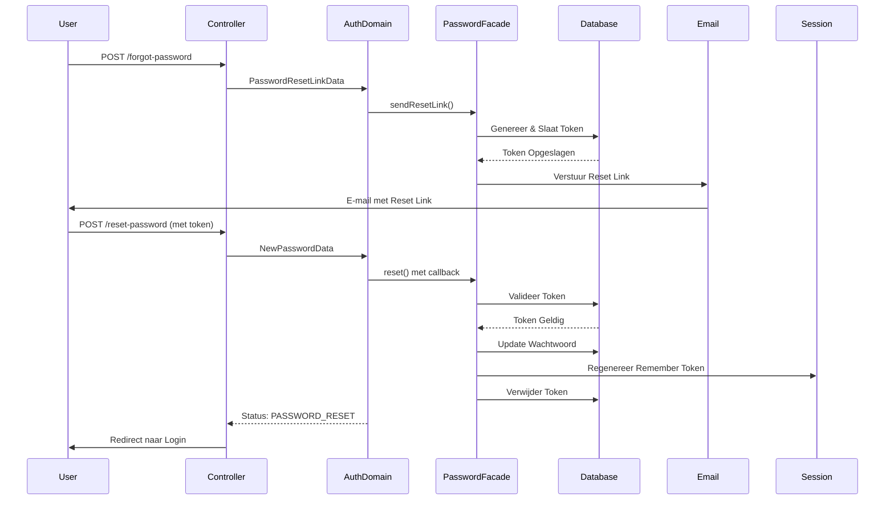

## Scope & Context

**BELANGRIJK:** Deze documentatie behandelt een specifieke case waarbij meerdere systemen nauw met elkaar interacteren tijdens wachtwoord reset. De scope is beperkt tot:

- **Primaire Systemen/Componenten:** Auth Domain, Laravel Password Facade, Email System, Database, Session Management
- **Interactie Scope:** Wachtwoord reset flow waarbij reset link wordt aangevraagd, e-mail wordt verstuurd, en wachtwoord wordt gereset
- **Gebruik Case:** Gebruiker vraagt wachtwoord reset aan en reset wachtwoord via e-mail link

<Note>
**Waarom deze specifieke documentatie?**
Deze case vereist extra detail omdat wachtwoord reset meerdere systemen coördineert: Auth Domain voor validatie, Laravel Password Facade voor token beheer, Email System voor link verzending, Database voor token opslag, en Session Management voor beveiliging. Deze documentatie gaat dieper in op de interacties dan de standaard domain of logic documentatie.
</Note>

## Systeem Overzicht

<CardGroup cols={2}>
<Card title="Systeem 1: Auth Domain" icon="sitemap">
  **Rol:** Valideert reset requests en coördineert reset flow
  
  **Verantwoordelijkheden:**
  - Valideert e-mail voor reset link aanvraag
  - Valideert token en nieuw wachtwoord voor reset
  - Coördineert via SendPasswordResetLinkAction en ResetPasswordAction
  
  **Locatie:** `src/Domain/Auth/`
</Card>

<Card title="Systeem 2: Laravel Password Facade" icon="sitemap">
  **Rol:** Beheert wachtwoord reset tokens en validatie
  
  **Verantwoordelijkheden:**
  - Genereert unieke reset tokens
  - Slaat tokens op in password_resets tabel
  - Valideert tokens bij reset
  - Beheert token expiry
  
  **Locatie:** Laravel Framework Core
</Card>

<Card title="Systeem 3: Email System" icon="sitemap">
  **Rol:** Verstuurt wachtwoord reset links via e-mail
  
  **Verantwoordelijkheden:**
  - Genereert reset link URL met token
  - Verstuurt e-mail naar gebruiker
  - Beheert e-mail delivery
  
  **Locatie:** Laravel Mail System + SMTP/Email Provider
</Card>

<Card title="Systeem 4: Database" icon="database">
  **Rol:** Persisteert reset tokens en User data
  
  **Verantwoordelijkheden:**
  - Slaat reset tokens op in password_resets tabel
  - Update User wachtwoord na reset
  - Valideert token expiry
  
  **Locatie:** MySQL/Database Server
</Card>

<Card title="Systeem 5: Session Management" icon="sitemap">
  **Rol:** Beheert gebruikerssessies na reset
  
  **Verantwoordelijkheden:**
  - Invalideert oude sessies na wachtwoord wijziging
  - Genereert nieuwe remember tokens
  - Beveiligt tegen sessie hijacking
  
  **Locatie:** Laravel Session System
</Card>
</CardGroup>

## Interactie Diagram



## Gedetailleerde Interacties

<AccordionGroup>
<Accordion title="Interactie 1: Auth Domain → Laravel Password (Reset Link Aanvraag)">

**Trigger:** Wanneer SendPasswordResetLinkAction wordt uitgevoerd

**Data Flow:**
- **Input:** PasswordResetLinkData (e-mail)
- **Output:** Status string (RESET_LINK_SENT, etc.)
- **Side Effects:** Token wordt gegenereerd en opgeslagen, e-mail wordt getriggerd

**Implementatie:**
```php
src/Domain/Auth/Actions/SendPasswordResetLinkAction.php
$status = Password::sendResetLink($passwordResetLinkData->toArray());
```

**Timing:** Direct na DTO validatie

**Foutafhandeling:** Als Password facade faalt, wordt status string geretourneerd. Geen exception. Status kan worden gecontroleerd.

**Afhankelijkheden:** Password facade moet geconfigureerd zijn, database connectie voor password_resets tabel

</Accordion>

<Accordion title="Interactie 2: Laravel Password → Database (Token Opslag)">

**Trigger:** Wanneer Password::sendResetLink() wordt aangeroepen

**Data Flow:**
- **Input:** E-mail adres
- **Output:** Token wordt opgeslagen in password_resets tabel
- **Side Effects:** Oude tokens worden overschreven, nieuwe token wordt gegenereerd

**Implementatie:**
```php
// Laravel internal
DB::table('password_resets')->updateOrInsert([...]);
```

**Timing:** Direct na token generatie, voor e-mail verzending

**Foutafhandeling:** Als database insert faalt, wordt exception gegooid. Token wordt niet opgeslagen. Reset link wordt niet verstuurd.

**Afhankelijkheden:** password_resets tabel moet bestaan, database connectie

</Accordion>

<Accordion title="Interactie 3: Laravel Password → Email System (E-mail Verzending)">

**Trigger:** Wanneer token succesvol is opgeslagen

**Data Flow:**
- **Input:** E-mail adres en reset token
- **Output:** E-mail wordt verstuurd naar gebruiker
- **Side Effects:** Reset link wordt gegenereerd en verstuurd

**Implementatie:**
```php
// Laravel internal - sends email with reset link
Mail::send('auth.passwords.reset', ['token' => $token], ...);
```

**Timing:** Direct na token opslag

**Foutafhandeling:** Als e-mail verzending faalt, wordt exception gelogd. Token blijft in database. Gebruiker ontvangt geen e-mail.

**Afhankelijkheden:** Mail driver moet geconfigureerd zijn, SMTP provider moet beschikbaar zijn

</Accordion>

<Accordion title="Interactie 4: Auth Domain → Laravel Password (Wachtwoord Reset)">

**Trigger:** Wanneer ResetPasswordAction wordt uitgevoerd met geldige token

**Data Flow:**
- **Input:** NewPasswordData (token, e-mail, nieuw wachtwoord)
- **Output:** Status string (PASSWORD_RESET, etc.)
- **Side Effects:** Token wordt gevalideerd, wachtwoord wordt gehasht en opgeslagen, token wordt verwijderd

**Implementatie:**
```php
src/Domain/Auth/Actions/ResetPasswordAction.php
$status = Password::reset($newPasswordData->toArray(), function ($user) {
    // Update password
});
```

**Timing:** Direct na DTO validatie

**Foutafhandeling:** Als token ongeldig is, wordt status INVALID_TOKEN geretourneerd. Wachtwoord wordt niet gereset.

**Afhankelijkheden:** Token moet bestaan in database, token moet geldig zijn, User moet bestaan

</Accordion>

<Accordion title="Interactie 5: ResetPasswordAction → Session Management (Token Regeneratie)">

**Trigger:** Wanneer wachtwoord succesvol wordt gereset

**Data Flow:**
- **Input:** User instance
- **Output:** Nieuwe remember token wordt gegenereerd
- **Side Effects:** Oude remember tokens worden ongeldig

**Implementatie:**
```php
src/Domain/Auth/Actions/ResetPasswordAction.php
'remember_token' => Str::random(60),
```

**Timing:** Direct na wachtwoord update, voor event dispatch

**Foutafhandeling:** Als token generatie faalt, wordt exception gegooid. Wachtwoord reset faalt.

**Afhankelijkheden:** Str helper moet beschikbaar zijn

</Accordion>
</AccordionGroup>

## Volledige Flow



## Data Synchronisatie

Systemen delen reset tokens en User data.

<Warning>
**Data Consistency:**
Token wordt eerst opgeslagen in database voordat e-mail wordt verstuurd. Als e-mail verzending faalt, bestaat token in database maar gebruiker heeft geen link. Token kan verlopen zonder gebruik.
</Warning>

### Gedeelde Data Structuren

<ParamField path="token" type="string" required>
  Reset token wordt gegenereerd door Password Facade, opgeslagen in database, en gebruikt in e-mail link
</ParamField>

<ParamField path="email" type="string" required>
  E-mail wordt gebruikt door Auth Domain voor validatie, Password Facade voor token lookup, en Email System voor verzending
</ParamField>

<ParamField path="created_at" type="timestamp">
  Token timestamp wordt gebruikt voor expiry validatie
</ParamField>

## Afhankelijkheden & Constraints

<CardGroup cols={2}>
<Card title="Auth Domain Afhankelijkheden" icon="link">
  **Vereist van Password Facade:**
  - Password::sendResetLink() moet werken
  - Password::reset() moet werken
  
  **Vereist van Database:**
  - password_resets tabel moet bestaan
  - users tabel moet bestaan
</Card>

<Card title="Password Facade Afhankelijkheden" icon="link">
  **Vereist van Database:**
  - password_resets tabel met correct schema
  - Token expiry configuratie
  
  **Vereist van Email System:**
  - Mail driver configuratie
  - E-mail templates
</Card>
</CardGroup>

## Edge Cases & Foutscenario's

<Warning>
**Edge Case 1: E-mail Verzending Fout**

**Scenario:** Token wordt opgeslagen maar e-mail verzending faalt

**Impact op Systemen:**
- **Auth Domain:** Status wordt geretourneerd (mogelijk succes)
- **Password Facade:** Token bestaat in database
- **Email System:** E-mail wordt niet verstuurd
- **Gebruiker:** Ontvangt geen reset link

**Oplossing:** Token blijft in database tot expiry. Gebruiker kan nieuwe reset link aanvragen. Oude token wordt overschreven.
</Warning>

<Warning>
**Edge Case 2: Token Verlopen**

**Scenario:** Gebruiker klikt op reset link maar token is verlopen

**Impact op Systemen:**
- **Auth Domain:** ResetPasswordAction wordt uitgevoerd
- **Password Facade:** Token validatie faalt (expired)
- **Database:** Token bestaat maar is ongeldig
- **Gebruiker:** Kan wachtwoord niet resetten

**Oplossing:** Status INVALID_TOKEN wordt geretourneerd. Gebruiker moet nieuwe reset link aanvragen.
</Warning>

<Warning>
**Edge Case 3: Token Al Gebruikt**

**Scenario:** Gebruiker gebruikt reset link meerdere keren

**Impact op Systemen:**
- **Auth Domain:** Eerste reset is succesvol
- **Password Facade:** Token wordt verwijderd na eerste gebruik
- **Database:** Token bestaat niet meer
- **Gebruiker:** Tweede poging faalt

**Oplossing:** Token wordt verwijderd na gebruik. Tweede poging faalt met INVALID_TOKEN. Gebruiker moet nieuwe reset link aanvragen.
</Warning>

## Test Scenario's

### Happy Path: Volledige Reset Flow

**Scenario:** Alle systemen werken correct

**Stappen:**
1. Gebruiker vraagt reset link aan
2. Token wordt gegenereerd en opgeslagen
3. E-mail wordt verstuurd
4. Gebruiker klikt op link
5. Wachtwoord wordt gereset

**Verwachting:**
- **Auth Domain:** Beide acties zijn succesvol
- **Password Facade:** Token wordt beheerd correct
- **Email System:** E-mail wordt verstuurd
- **Database:** Token wordt opgeslagen en verwijderd
- **Session:** Remember token wordt geregenereerd

### Edge Case 1: E-mail Verzending Fout

**Scenario:** Token wordt opgeslagen maar e-mail faalt

**Verwachting:**
- Token blijft in database
- Gebruiker ontvangt geen e-mail
- Gebruiker kan nieuwe reset link aanvragen
- Oude token wordt overschreven

### Edge Case 2: Ongeldig Token

**Scenario:** Gebruiker gebruikt verlopen of ongeldig token

**Verwachting:**
- ResetPasswordAction faalt
- Status INVALID_TOKEN wordt geretourneerd
- Wachtwoord wordt niet gereset
- Gebruiker moet nieuwe link aanvragen

## Betrokken Code

<CardGroup cols={2}>
<Card title="SendPasswordResetLinkAction" icon="code" href="/domains/auth#sendpasswordresetlinkaction">
  Action voor reset link aanvraag
</Card>

<Card title="ResetPasswordAction" icon="code" href="/domains/auth#resetpasswordaction">
  Action voor wachtwoord reset
</Card>

<Card title="Password Reset Link Flow" icon="workflow" href="/logic/password-reset-link">
  Gerelateerde business logic flow
</Card>

<Card title="Reset Password Flow" icon="workflow" href="/logic/reset-password">
  Gerelateerde business logic flow
</Card>
</CardGroup>

## Gerelateerde Documentatie

<CardGroup cols={2}>
<Card title="Domain: Auth" icon="sitemap" href="/domains/auth">
  Volledige documentatie van het Auth domein
</Card>
</CardGroup>

