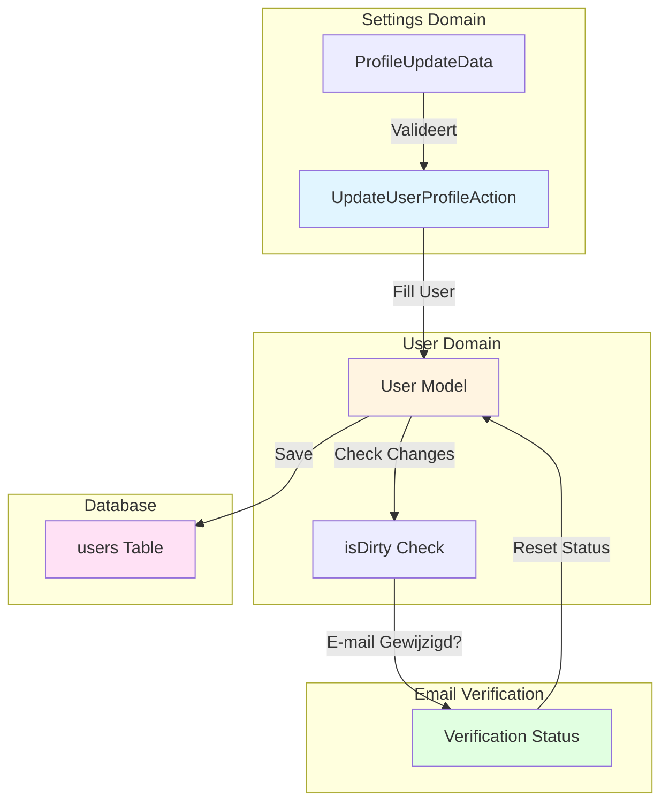
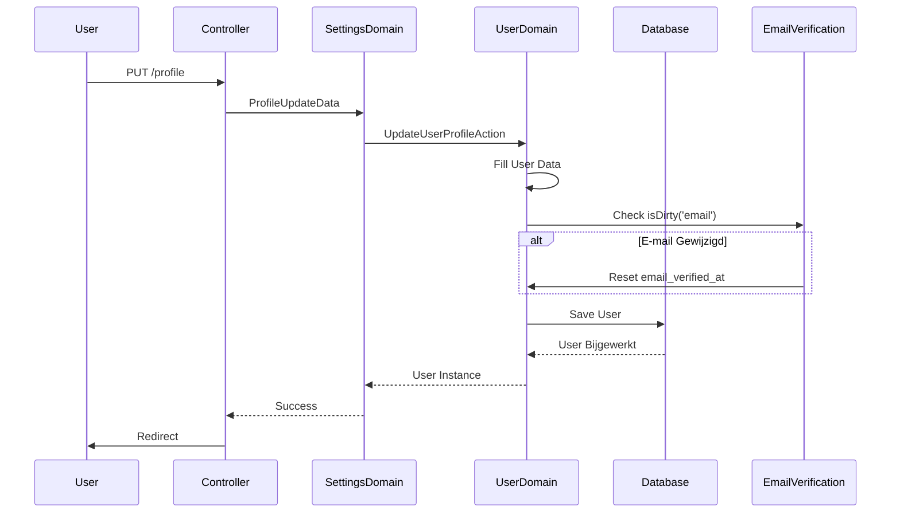

## Scope & Context

**BELANGRIJK:** Deze documentatie behandelt een specifieke case waarbij meerdere systemen nauw met elkaar interacteren tijdens profiel update. De scope is beperkt tot:

- **Primaire Systemen/Componenten:** Settings Domain, User Domain, Database, Email Verification System
- **Interactie Scope:** Profiel update flow waarbij naam/e-mail wordt bijgewerkt en e-mail verificatie status wordt gereset
- **Gebruik Case:** Gebruiker werkt profiel bij en moet e-mail opnieuw verifiëren na wijziging

<Note>
**Waarom deze specifieke documentatie?**
Deze case vereist extra detail omdat profiel update meerdere systemen coördineert: Settings Domain voor validatie, User Domain voor opslag, Database voor persistentie, en Email Verification System voor status beheer. Deze documentatie gaat dieper in op de interacties dan de standaard domain of logic documentatie.
</Note>

## Systeem Overzicht

<CardGroup cols={2}>
<Card title="Systeem 1: Settings Domain" icon="sitemap">
  **Rol:** Valideert profiel update data
  
  **Verantwoordelijkheden:**
  - Valideert ProfileUpdateData DTO
  - Coördineert via UpdateUserProfileAction
  
  **Locatie:** `src/Domain/Settings/`
</Card>

<Card title="Systeem 2: User Domain" icon="sitemap">
  **Rol:** Beheert User model en update operaties
  
  **Verantwoordelijkheden:**
  - Update User record in database
  - Detecteert e-mail wijzigingen
  - Reset email_verified_at bij e-mail wijziging
  
  **Locatie:** `src/Domain/User/`
</Card>

<Card title="Systeem 3: Database" icon="database">
  **Rol:** Persisteert User data
  
  **Verantwoordelijkheden:**
  - Slaat bijgewerkte User data op
  - Valideert constraints
  - Beheert email_verified_at timestamp
  
  **Locatie:** MySQL/Database Server
</Card>

<Card title="Systeem 4: Email Verification System" icon="sitemap">
  **Rol:** Beheert e-mail verificatie status
  
  **Verantwoordelijkheden:**
  - Reset verificatie status bij e-mail wijziging
  - Vereist nieuwe verificatie na wijziging
  - Beheert verificatie state
  
  **Locatie:** Laravel Email Verification System
</Card>
</CardGroup>

## Interactie Diagram



## Gedetailleerde Interacties

<AccordionGroup>
<Accordion title="Interactie 1: Settings Domain → User Domain (Profiel Update)">

**Trigger:** Wanneer UpdateUserProfileAction wordt uitgevoerd

**Data Flow:**
- **Input:** ProfileUpdateData (naam, e-mail)
- **Output:** Bijgewerkte User instance
- **Side Effects:** User data wordt bijgewerkt, e-mail verificatie wordt mogelijk gereset

**Implementatie:**
```php
src/Domain/User/Actions/UpdateUserProfileAction.php
$user->fill($profileData->toArray());
```

**Timing:** Direct na DTO validatie

**Foutafhandeling:** Als fill() faalt, wordt exception gegooid. User wordt niet bijgewerkt.

**Afhankelijkheden:** User model moet bestaan, ProfileUpdateData moet geldig zijn

</Accordion>

<Accordion title="Interactie 2: User Domain → Email Verification (Status Reset)">

**Trigger:** Wanneer e-mail wordt gewijzigd (isDirty('email') = true)

**Data Flow:**
- **Input:** User instance met gewijzigde e-mail
- **Output:** email_verified_at wordt null
- **Side Effects:** E-mail verificatie status wordt gereset

**Implementatie:**
```php
src/Domain/User/Actions/UpdateUserProfileAction.php
if ($user->isDirty('email')) {
    $user->email_verified_at = null;
}
```

**Timing:** Direct na fill(), voor save()

**Foutafhandeling:** Als isDirty check faalt, wordt verificatie mogelijk niet gereset. Inconsistente state.

**Afhankelijkheden:** User model moet isDirty() ondersteunen, email_verified_at veld moet bestaan

</Accordion>

<Accordion title="Interactie 3: User Domain → Database (Persistentie)">

**Trigger:** Wanneer User save() wordt aangeroepen

**Data Flow:**
- **Input:** User attributes (naam, e-mail, email_verified_at)
- **Output:** User record wordt bijgewerkt in database
- **Side Effects:** Database record wordt geüpdatet, constraints worden gecontroleerd

**Implementatie:**
```php
src/Domain/User/Actions/UpdateUserProfileAction.php
$user->save();
```

**Timing:** Direct na e-mail verificatie reset (indien nodig)

**Foutafhandeling:** Als database update faalt, wordt exception gegooid. User wordt niet bijgewerkt.

**Afhankelijkheden:** Database connectie, users tabel moet bestaan

</Accordion>
</AccordionGroup>

## Volledige Flow



## Data Synchronisatie

Systemen delen User data en e-mail verificatie status.

<Warning>
**Data Consistency:**
E-mail verificatie status wordt gereset voordat User wordt opgeslagen. Als save() faalt, blijft oude verificatie status. Inconsistente state mogelijk.
</Warning>

## Afhankelijkheden & Constraints

<CardGroup cols={2}>
<Card title="Settings Domain Afhankelijkheden" icon="link">
  **Vereist van User Domain:**
  - UpdateUserProfileAction moet beschikbaar zijn
  - User model moet bestaan
</Card>

<Card title="User Domain Afhankelijkheden" icon="link">
  **Vereist van Database:**
  - users tabel moet bestaan
  - email_verified_at veld moet bestaan
</Card>
</CardGroup>

## Edge Cases & Foutscenario's

<Warning>
**Edge Case 1: Database Update Fout na Status Reset**

**Scenario:** E-mail verificatie wordt gereset maar database update faalt

**Impact op Systemen:**
- **User Domain:** email_verified_at is null in memory
- **Database:** Oude waarde blijft bestaan
- **Email Verification:** Inconsistente state

**Oplossing:** Exception wordt gegooid. User wordt niet bijgewerkt. Oude verificatie status blijft.
</Warning>

## Test Scenario's

### Happy Path: Profiel Update met E-mail Wijziging

**Scenario:** Gebruiker wijzigt naam en e-mail

**Verwachting:**
- Profiel wordt bijgewerkt
- E-mail verificatie wordt gereset
- Gebruiker moet e-mail opnieuw verifiëren

### Edge Case 1: Alleen Naam Wijzigen

**Scenario:** Gebruiker wijzigt alleen naam, e-mail blijft hetzelfde

**Verwachting:**
- Profiel wordt bijgewerkt
- E-mail verificatie blijft geldig
- Geen nieuwe verificatie vereist

## Betrokken Code

<CardGroup cols={2}>
<Card title="UpdateUserProfileAction" icon="code" href="/domains/user#updateuserprofileaction">
  Action voor profiel update
</Card>

<Card title="Update Profile Flow" icon="workflow" href="/logic/update-profile">
  Gerelateerde business logic flow
</Card>
</CardGroup>

## Gerelateerde Documentatie

<CardGroup cols={2}>
<Card title="Domain: Settings" icon="sitemap" href="/domains/settings">
  Volledige documentatie van het Settings domein
</Card>

<Card title="Domain: User" icon="sitemap" href="/domains/user">
  Volledige documentatie van het User domein
</Card>
</CardGroup>


