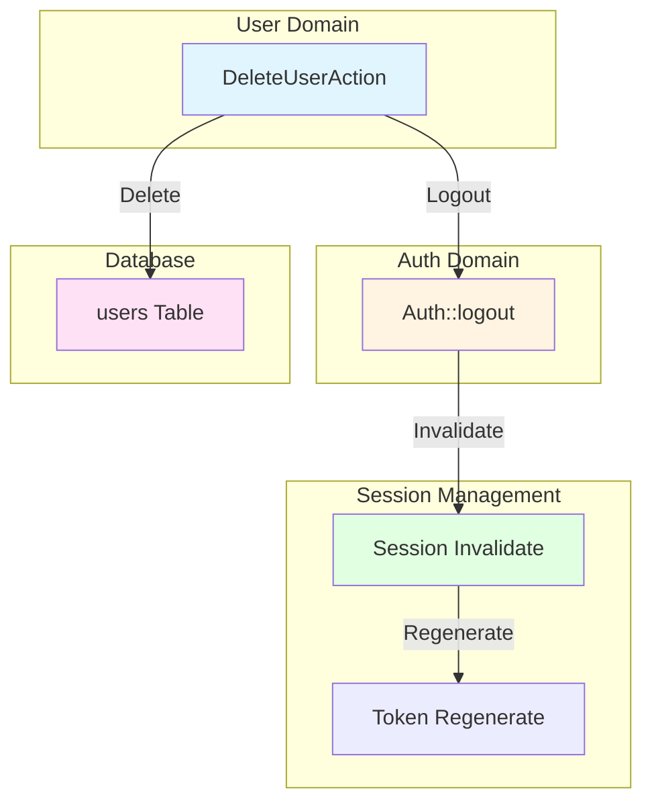
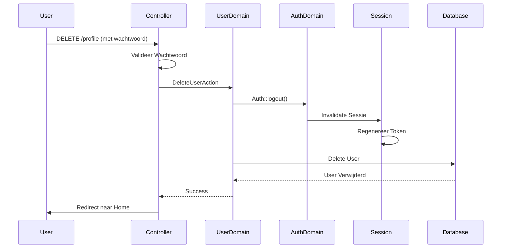

## Scope & Context

**BELANGRIJK:** Deze documentatie behandelt een specifieke case waarbij meerdere systemen nauw met elkaar interacteren tijdens account verwijdering. De scope is beperkt tot:

- **Primaire Systemen/Componenten:** User Domain, Auth Domain, Session Management, Database
- **Interactie Scope:** Account verwijdering flow waarbij gebruiker wordt uitgelogd, sessie wordt geïnvalideerd, en account wordt verwijderd
- **Gebruik Case:** Gebruiker verwijdert account en alle sessies worden beëindigd

<Note>
**Waarom deze specifieke documentatie?**
Deze case vereist extra detail omdat account verwijdering meerdere systemen coördineert: User Domain voor verwijdering, Auth Domain voor logout, Session Management voor cleanup, en Database voor data verwijdering. Deze documentatie gaat dieper in op de interacties dan de standaard domain of logic documentatie.
</Note>

## Systeem Overzicht

<CardGroup cols={2}>
<Card title="Systeem 1: User Domain" icon="sitemap">
  **Rol:** Coördineert account verwijdering
  
  **Verantwoordelijkheden:**
  - Verwijdert User uit database
  - Coördineert via DeleteUserAction
  
  **Locatie:** `src/Domain/User/`
</Card>

<Card title="Systeem 2: Auth Domain" icon="sitemap">
  **Rol:** Beëindigt gebruikerssessie
  
  **Verantwoordelijkheden:**
  - Logt gebruiker uit via Auth::logout()
  - Beëindigt alle actieve sessies
  
  **Locatie:** Laravel Auth System
</Card>

<Card title="Systeem 3: Session Management" icon="sitemap">
  **Rol:** Beheert sessie cleanup
  
  **Verantwoordelijkheden:**
  - Invalideert huidige sessie
  - Regenereert CSRF token
  - Verwijdert sessie data
  
  **Locatie:** Laravel Session System
</Card>

<Card title="Systeem 4: Database" icon="database">
  **Rol:** Verwijdert User data
  
  **Verantwoordelijkheden:**
  - Verwijdert User record
  - Handelt foreign key constraints af
  - Beheert data integriteit
  
  **Locatie:** MySQL/Database Server
</Card>
</CardGroup>

## Interactie Diagram



## Gedetailleerde Interacties

<AccordionGroup>
<Accordion title="Interactie 1: User Domain → Auth Domain (Logout)">

**Trigger:** Wanneer DeleteUserAction wordt uitgevoerd

**Data Flow:**
- **Input:** User instance
- **Output:** Gebruiker wordt uitgelogd
- **Side Effects:** Alle actieve sessies worden beëindigd

**Implementatie:**
```php
src/Domain/User/Actions/DeleteUserAction.php
Auth::logout();
```

**Timing:** Direct voor User verwijdering

**Foutafhandeling:** Als logout faalt, wordt exception gegooid. Verwijdering wordt mogelijk niet uitgevoerd.

**Afhankelijkheden:** Auth system moet geconfigureerd zijn, gebruiker moet ingelogd zijn

</Accordion>

<Accordion title="Interactie 2: Auth Domain → Session Management (Sessie Invalidatie)">

**Trigger:** Wanneer Auth::logout() wordt aangeroepen

**Data Flow:**
- **Input:** Huidige sessie
- **Output:** Sessie wordt geïnvalideerd
- **Side Effects:** Sessie data wordt gewist, CSRF token wordt geregenereerd

**Implementatie:**
```php
src/App/Portal/Settings/Controllers/ProfileController.php
$request->session()->invalidate();
$request->session()->regenerateToken();
```

**Timing:** Direct na logout, voor redirect

**Foutafhandeling:** Als sessie invalidatie faalt, wordt exception gegooid. Sessie blijft mogelijk actief.

**Afhankelijkheden:** Session driver moet geconfigureerd zijn

</Accordion>

<Accordion title="Interactie 3: User Domain → Database (User Verwijdering)">

**Trigger:** Wanneer User delete() wordt aangeroepen

**Data Flow:**
- **Input:** User instance
- **Output:** User record wordt verwijderd uit database
- **Side Effects:** User data wordt permanent verwijderd

**Implementatie:**
```php
src/Domain/User/Actions/DeleteUserAction.php
return $user->delete() ?? false;
```

**Timing:** Direct na logout

**Foutafhandeling:** Als delete faalt (bijv. foreign key constraint), wordt false geretourneerd. User blijft in database.

**Afhankelijkheden:** Database connectie, foreign key constraints moeten worden afgehandeld

</Accordion>
</AccordionGroup>

## Volledige Flow



## Data Synchronisatie

Systemen coördineren User verwijdering en sessie cleanup.

<Warning>
**Data Consistency:**
Logout gebeurt voor User verwijdering. Als delete faalt na logout, is gebruiker uitgelogd maar account bestaat nog. Inconsistente state mogelijk.
</Warning>

## Afhankelijkheden & Constraints

<CardGroup cols={2}>
<Card title="User Domain Afhankelijkheden" icon="link">
  **Vereist van Auth Domain:**
  - Auth::logout() moet werken
  
  **Vereist van Database:**
  - users tabel moet bestaan
  - Foreign key constraints moeten worden afgehandeld
</Card>

<Card title="Session Management Afhankelijkheden" icon="link">
  **Vereist van Auth Domain:**
  - Logout moet sessie triggeren
  
  **Vereist van Session Driver:**
  - Session storage moet beschikbaar zijn
</Card>
</CardGroup>

## Edge Cases & Foutscenario's

<Warning>
**Edge Case 1: Database Delete Fout na Logout**

**Scenario:** Gebruiker wordt uitgelogd maar database delete faalt

**Impact op Systemen:**
- **Auth Domain:** Gebruiker is uitgelogd
- **User Domain:** Delete faalt
- **Database:** User bestaat nog
- **Gebruiker:** Kan niet meer inloggen maar account bestaat

**Oplossing:** False wordt geretourneerd. Gebruiker moet handmatig opnieuw inloggen en verwijderen. Inconsistente state.
</Warning>

<Warning>
**Edge Case 2: Foreign Key Constraint**

**Scenario:** User heeft relaties met andere tabellen

**Impact op Systemen:**
- **Database:** Foreign key constraint voorkomt verwijdering
- **User Domain:** Delete faalt
- **Gebruiker:** Account wordt niet verwijderd

**Oplossing:** Database exception wordt gegooid. Relaties moeten eerst worden verwijderd of soft deletes gebruiken.
</Warning>

## Test Scenario's

### Happy Path: Volledige Account Verwijdering

**Scenario:** Alle systemen werken correct

**Verwachting:**
- Gebruiker wordt uitgelogd
- Sessie wordt geïnvalideerd
- User wordt verwijderd uit database
- Gebruiker kan niet meer inloggen

### Edge Case 1: Database Delete Fout

**Scenario:** Logout slaagt maar delete faalt

**Verwachting:**
- Gebruiker is uitgelogd
- Sessie is geïnvalideerd
- User bestaat nog in database
- Gebruiker kan niet inloggen (inconsistente state)

## Betrokken Code

<CardGroup cols={2}>
<Card title="DeleteUserAction" icon="code" href="/domains/user#deleteuseraction">
  Action voor account verwijdering
</Card>

<Card title="Delete User Flow" icon="workflow" href="/logic/delete-user">
  Gerelateerde business logic flow
</Card>
</CardGroup>

## Gerelateerde Documentatie

<CardGroup cols={2}>
<Card title="Domain: User" icon="sitemap" href="/domains/user">
  Volledige documentatie van het User domein
</Card>

<Card title="Domain: Auth" icon="sitemap" href="/domains/auth">
  Volledige documentatie van het Auth domein
</Card>
</CardGroup>


