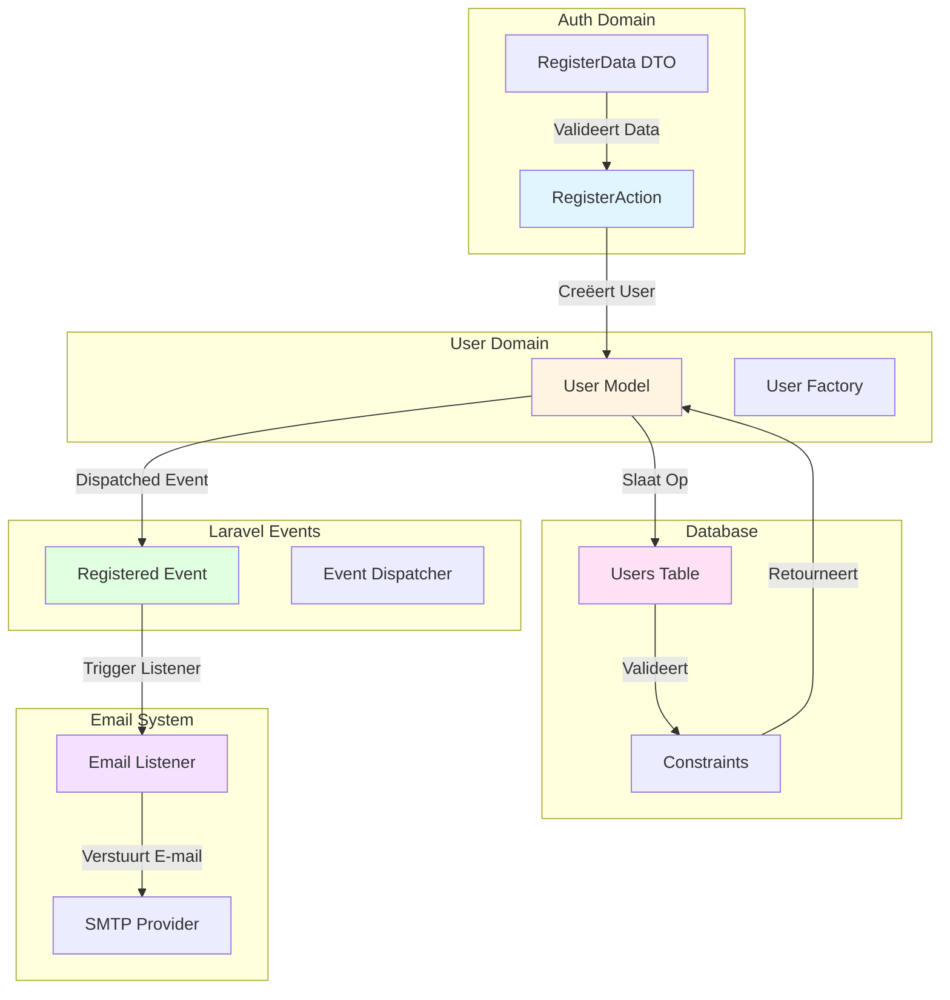
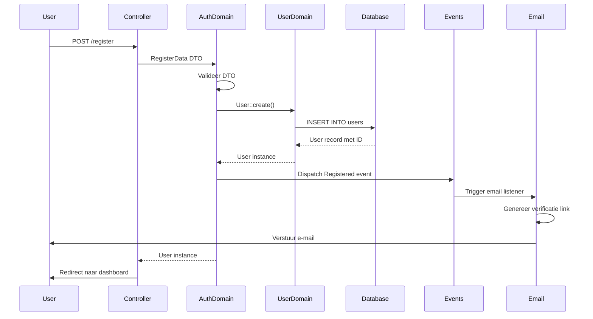

## Scope & Context

**BELANGRIJK:** Deze documentatie behandelt een specifieke case waarbij meerdere systemen nauw met elkaar interacteren tijdens gebruiker registratie. De scope is beperkt tot:

- **Primaire Systemen/Componenten:** Auth Domain, User Domain, Laravel Events System, Database, Email System
- **Interactie Scope:** Registratie flow waarbij gebruiker wordt aangemaakt, event wordt gedispatched, en e-mail verificatie wordt getriggerd
- **Gebruik Case:** Nieuwe gebruiker registreert account en ontvangt e-mail verificatie link

<Note>
**Waarom deze specifieke documentatie?**
Deze case vereist extra detail omdat registratie meerdere systemen coördineert: Auth Domain voor validatie, User Domain voor opslag, Events System voor asynchrone verwerking, en Email System voor verificatie. Deze documentatie gaat dieper in op de interacties dan de standaard domain of logic documentatie.
</Note>

## Systeem Overzicht

Geef een overzicht van alle betrokken systemen, componenten of modules en hun rol in deze specifieke case.

<CardGroup cols={2}>
<Card title="Systeem 1: Auth Domain" icon="sitemap">
  **Rol:** Valideert registratiegegevens en coördineert registratie flow
  
  **Verantwoordelijkheden:**
  - Valideert registratie DTO (naam, e-mail, wachtwoord)
  - Controleert e-mail uniciteit
  - Coördineert User creatie via RegisterAction
  - Dispatched Registered event
  
  **Locatie:** `src/Domain/Auth/`
</Card>

<Card title="Systeem 2: User Domain" icon="sitemap">
  **Rol:** Beheert User model en database operaties
  
  **Verantwoordelijkheden:**
  - Creëert User record in database
  - Hasht wachtwoord voor opslag
  - Beheert User model relaties
  - Retourneert aangemaakte User
  
  **Locatie:** `src/Domain/User/`
</Card>

<Card title="Systeem 3: Laravel Events System" icon="sitemap">
  **Rol:** Dispatched en beheert events voor asynchrone verwerking
  
  **Verantwoordelijkheden:**
  - Dispatched Registered event na User creatie
  - Beheert event listeners (indien geconfigureerd)
  - Ondersteunt event-driven architecture
  
  **Locatie:** Laravel Framework Core
</Card>

<Card title="Systeem 4: Database" icon="database">
  **Rol:** Persisteert User data en events
  
  **Verantwoordelijkheden:**
  - Slaat User record op
  - Valideert database constraints (e-mail uniciteit)
  - Ondersteunt transacties
  - Slaat event data op (indien nodig)
  
  **Locatie:** MySQL/Database Server
</Card>

<Card title="Systeem 5: Email System" icon="envelope">
  **Rol:** Verstuurt e-mail verificatie links
  
  **Verantwoordelijkheden:**
  - Ontvangt Registered event (via listener)
  - Genereert e-mail verificatie link
  - Verstuurt e-mail naar gebruiker
  - Beheert e-mail delivery status
  
  **Locatie:** Laravel Mail System + SMTP/Email Provider
</Card>
</CardGroup>

## Interactie Diagram

Een gedetailleerd diagram dat alle interacties tussen de systemen toont.



## Gedetailleerde Interacties

Documenteer elke interactie tussen systemen in detail.

<AccordionGroup>
<Accordion title="Interactie 1: Auth Domain → User Domain (User Creatie)">

**Trigger:** Wanneer RegisterAction wordt uitgevoerd met geldige RegisterData

**Data Flow:**
- **Input:** RegisterData (naam, e-mail, wachtwoord, wachtwoord bevestiging)
- **Output:** User model instance
- **Side Effects:** User record wordt aangemaakt in database, wachtwoord wordt gehasht

**Implementatie:**
```php
src/Domain/Auth/Actions/RegisterAction.php
$user = User::create([
    'name' => $registerData->name,
    'email' => $registerData->email,
    'password' => Hash::make($registerData->password),
]);
```

**Timing:** Direct na DTO validatie, voor event dispatch

**Foutafhandeling:** Als User::create() faalt, wordt exception gegooid. Event wordt niet gedispatched. Registratie faalt.

**Afhankelijkheden:** Database moet beschikbaar zijn, e-mail moet uniek zijn (database constraint)

</Accordion>

<Accordion title="Interactie 2: User Domain → Database (Persistentie)">

**Trigger:** Wanneer User::create() wordt aangeroepen

**Data Flow:**
- **Input:** User attributes (naam, e-mail, gehasht wachtwoord)
- **Output:** User record met ID en timestamps
- **Side Effects:** Database record wordt aangemaakt, constraints worden gecontroleerd

**Implementatie:**
```php
src/Domain/User/Models/User.php
User::create([...])
```

**Timing:** Direct na User model creatie call

**Foutafhandeling:** Als database constraint faalt (bijv. duplicate e-mail), wordt database exception gegooid. User wordt niet aangemaakt.

**Afhankelijkheden:** Database connectie, users tabel moet bestaan, constraints moeten correct zijn

</Accordion>

<Accordion title="Interactie 3: Auth Domain → Laravel Events (Event Dispatch)">

**Trigger:** Na succesvolle User creatie

**Data Flow:**
- **Input:** User model instance
- **Output:** Registered event wordt gedispatched
- **Side Effects:** Event listeners worden getriggerd (indien geconfigureerd)

**Implementatie:**
```php
src/Domain/Auth/Actions/RegisterAction.php
event(new Registered($user));
```

**Timing:** Direct na User creatie, voor return statement

**Foutafhandeling:** Als event dispatch faalt, wordt exception gegooid. User is al aangemaakt. Mogelijk inconsistent state.

**Afhankelijkheden:** Event dispatcher moet geconfigureerd zijn, listeners moeten beschikbaar zijn

</Accordion>

<Accordion title="Interactie 4: Laravel Events → Email System (E-mail Verificatie)">

**Trigger:** Wanneer Registered event wordt gedispatched en listener is geconfigureerd

**Data Flow:**
- **Input:** Registered event met User instance
- **Output:** E-mail wordt verstuurd naar gebruiker
- **Side Effects:** E-mail verificatie link wordt gegenereerd en verstuurd

**Implementatie:**
```php
// Laravel default: app/Listeners/SendEmailVerificationNotification.php
$user->sendEmailVerificationNotification();
```

**Timing:** Asynchroon na event dispatch (kan via queue)

**Foutafhandeling:** Als e-mail verzending faalt, wordt exception gelogd. User blijft aangemaakt. E-mail kan opnieuw worden verzonden.

**Afhankelijkheden:** Mail driver moet geconfigureerd zijn, SMTP/email provider moet beschikbaar zijn

</Accordion>
</AccordionGroup>

## Volledige Flow

Een complete flow die alle stappen en interacties toont.



## Data Synchronisatie

Systemen delen User data via het User model.

<Warning>
**Data Consistency:**
User data wordt eerst aangemaakt in database voordat event wordt gedispatched. Als event dispatch faalt, bestaat User al in database maar event is niet verwerkt. E-mail verificatie kan ontbreken.
</Warning>

### Gedeelde Data Structuren

<ParamField path="id" type="int" required>
  User ID wordt gegenereerd door database en gebruikt door alle systemen
</ParamField>

<ParamField path="email" type="string" required>
  E-mail wordt gebruikt door Auth Domain voor validatie, User Domain voor opslag, en Email System voor verificatie
</ParamField>

<ParamField path="email_verified_at" type="datetime|null">
  E-mail verificatie status wordt beheerd door Email System en opgeslagen in User Domain
</ParamField>

### Synchronisatie Regels

<AccordionGroup>
<Accordion title="Regel 1: User Creatie voor Event Dispatch">

User moet succesvol worden aangemaakt voordat Registered event wordt gedispatched.

**Implementatie:**
```php
$user = User::create([...]);
event(new Registered($user));
```

**Consequentie:**
- Event bevat altijd geldige User instance
- Geen event dispatch zonder User
- Database integriteit is gegarandeerd

</Accordion>

<Accordion title="Regel 2: E-mail Uniciteit Validatie">

E-mail uniciteit wordt gecontroleerd op zowel DTO niveau als database niveau.

**Implementatie:**
```php
// DTO validatie
#[Unique('users', 'email')]
public string $email,

// Database constraint
$table->unique('email');
```

**Consequentie:**
- Dubbele validatie voorkomt race conditions
- Database constraint is laatste verdedigingslinie
- Consistentie tussen validatie en opslag

</Accordion>
</AccordionGroup>

## Afhankelijkheden & Constraints

Documenteer alle afhankelijkheden tussen systemen.

<CardGroup cols={2}>
<Card title="Auth Domain Afhankelijkheden" icon="link">
  **Vereist van User Domain:**
  - User model moet beschikbaar zijn
  - User::create() moet werken
  
  **Vereist van Database:**
  - Users tabel moet bestaan
  - Database connectie moet actief zijn
  
  **Vereist van Events System:**
  - Event dispatcher moet geconfigureerd zijn
</Card>

<Card title="User Domain Afhankelijkheden" icon="link">
  **Vereist van Database:**
  - Database connectie
  - Users tabel met correct schema
  - Constraints moeten actief zijn
  
  **Vereist van Auth Domain:**
  - RegisterData DTO met geldige data
</Card>

<Card title="Email System Afhankelijkheden" icon="link">
  **Vereist van Events System:**
  - Registered event moet worden gedispatched
  - Listener moet geconfigureerd zijn
  
  **Vereist van User Domain:**
  - User instance met e-mail adres
  
  **Vereist van Mail Configuration:**
  - Mail driver moet geconfigureerd zijn
  - SMTP/email provider moet beschikbaar zijn
</Card>
</CardGroup>

## Edge Cases & Foutscenario's

Specifieke edge cases die ontstaan door de interacties tussen systemen.

<Warning>
**Edge Case 1: Event Dispatch Fout na User Creatie**

**Scenario:** User wordt succesvol aangemaakt, maar event dispatch faalt

**Impact op Systemen:**
- **Auth Domain:** Exception wordt gegooid, maar User is al aangemaakt
- **User Domain:** User bestaat in database
- **Events System:** Event is niet gedispatched
- **Email System:** Geen e-mail wordt verstuurd

**Oplossing:** User blijft aangemaakt maar zonder e-mail verificatie. Gebruiker kan handmatig verificatie e-mail opnieuw aanvragen.
</Warning>

<Warning>
**Edge Case 2: E-mail Verzending Fout**

**Scenario:** User wordt aangemaakt en event wordt gedispatched, maar e-mail verzending faalt

**Impact op Systemen:**
- **Auth Domain:** Flow is succesvol voltooid
- **User Domain:** User bestaat in database
- **Events System:** Event is gedispatched
- **Email System:** E-mail verzending faalt (SMTP error, etc.)

**Oplossing:** Exception wordt gelogd. User kan later verificatie e-mail opnieuw aanvragen via email verification resend functionaliteit.
</Warning>

<Warning>
**Edge Case 3: Database Constraint Fout na DTO Validatie**

**Scenario:** DTO validatie slaagt, maar database constraint faalt (race condition)

**Impact op Systemen:**
- **Auth Domain:** DTO validatie is geslaagd
- **User Domain:** User::create() faalt met database exception
- **Database:** Constraint violation (duplicate e-mail)
- **Events System:** Event wordt niet gedispatched

**Oplossing:** Database exception wordt gegooid. Gebruiker ziet database error. Registratie faalt. DTO validatie voorkomt meestal dit scenario, maar race conditions zijn mogelijk.
</Warning>

<Warning>
**Edge Case 4: Partiële User Data**

**Scenario:** User wordt aangemaakt maar sommige velden zijn null of incomplete

**Impact op Systemen:**
- **Auth Domain:** Flow is succesvol
- **User Domain:** User bestaat maar met incomplete data
- **Email System:** E-mail kan worden verstuurd naar incomplete e-mail

**Oplossing:** DTO validatie voorkomt dit. Alle verplichte velden worden gevalideerd voordat User creatie.
</Warning>

## Test Scenario's

Specifieke test scenario's voor deze case.

### Happy Path: Volledige Registratie met E-mail

**Scenario:** Alle systemen werken correct en volledige flow wordt uitgevoerd

**Stappen:**
1. Gebruiker vult registratieformulier in
2. Controller valideert request
3. RegisterAction creëert User
4. Database slaat User op
5. Registered event wordt gedispatched
6. E-mail verificatie link wordt verstuurd

**Verwachting:**
- **Auth Domain:** Registratie is succesvol
- **User Domain:** User bestaat in database met gehasht wachtwoord
- **Events System:** Registered event is gedispatched
- **Email System:** E-mail is verstuurd naar gebruiker
- **Database:** User record bestaat met correcte data

### Edge Case 1: E-mail Verzending Fout

**Scenario:** User wordt aangemaakt maar e-mail verzending faalt

**Stappen:**
1. Gebruiker registreert succesvol
2. User wordt aangemaakt in database
3. Registered event wordt gedispatched
4. E-mail verzending faalt (SMTP error)

**Verwachting:**
- **Auth Domain:** Flow is succesvol (geen exception)
- **User Domain:** User bestaat in database
- **Events System:** Event is gedispatched
- **Email System:** Exception wordt gelogd, e-mail wordt niet verstuurd
- **Gebruiker:** Kan later verificatie e-mail opnieuw aanvragen

### Edge Case 2: Database Constraint Fout

**Scenario:** DTO validatie slaagt maar database constraint faalt

**Stappen:**
1. Gebruiker vult registratieformulier in
2. DTO validatie slaagt (e-mail lijkt uniek)
3. User::create() wordt aangeroepen
4. Database constraint violation (e-mail bestaat al - race condition)

**Verwachting:**
- **Auth Domain:** Database exception wordt gegooid
- **User Domain:** User wordt niet aangemaakt
- **Database:** Constraint voorkomt duplicate
- **Events System:** Event wordt niet gedispatched
- **Gebruiker:** Ziet database error, registratie faalt

### Edge Case 3: Event Dispatch Fout

**Scenario:** User wordt aangemaakt maar event dispatch faalt

**Stappen:**
1. Gebruiker registreert succesvol
2. User wordt aangemaakt in database
3. Event dispatch faalt (event dispatcher niet geconfigureerd)

**Verwachting:**
- **Auth Domain:** Exception wordt gegooid
- **User Domain:** User bestaat al in database
- **Events System:** Event is niet gedispatched
- **Email System:** Geen e-mail wordt verstuurd
- **Gebruiker:** User is aangemaakt maar zonder verificatie e-mail

## Betrokken Code

Links naar alle relevante code voor deze specifieke case.

<CardGroup cols={2}>
<Card title="RegisterAction" icon="code" href="/domains/auth#registeraction">
  Auth Domain Action die registratie coördineert
</Card>

<Card title="RegisterData" icon="code" href="/domains/auth#registerdata">
  DTO voor registratie gegevens
</Card>

<Card title="User Model" icon="code" href="/domains/user">
  User Domain model dat wordt aangemaakt
</Card>

<Card title="Register Flow" icon="workflow" href="/logic/register">
  Gerelateerde business logic flow documentatie
</Card>
</CardGroup>

## Gerelateerde Documentatie

Links naar gerelateerde documentatie die relevant is voor deze case.

<CardGroup cols={2}>
<Card title="Domain: Auth" icon="sitemap" href="/domains/auth">
  Volledige documentatie van het Auth domein
</Card>

<Card title="Domain: User" icon="sitemap" href="/domains/user">
  Volledige documentatie van het User domein
</Card>

<Card title="Logic: Register Flow" icon="workflow" href="/logic/register">
  Gerelateerde business logic flow
</Card>
</CardGroup>
