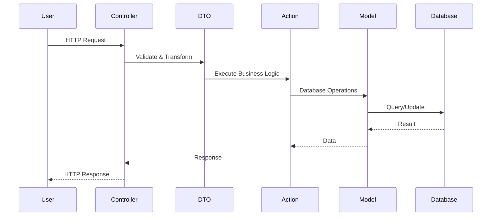

## Overzicht

Deze gids legt uit hoe je nieuwe features toevoegt aan dit Laravel DDD project. We volgen een gestructureerde workflow die zorgt voor schone, testbare en onderhoudbare code.

<Note>
**CRITICAL:** De eerste stap van de workflow is altijd: Check de `docs/ai-tools` documentatie en genereer/pas de juiste `.cursorrules` bestanden aan voor je domain.
</Note>

## Development Workflow

<Steps>
  <Step title="Cursor Rules Configuratie">
    **EERSTE STAP:** Check de `docs/ai-tools` documentatie en genereer/pas de juiste `.cursorrules` bestanden aan voor je domain.
    
    Dit zorgt ervoor dat Cursor AI de juiste context heeft en code genereert volgens de project conventies.
  </Step>
  
  <Step title="Create Model">
    Maak een Eloquent Model in `src/Domain/[Domain]/Models/`:
    
    ```php src/Domain/User/Models/User.php
    <?php
    
    namespace Src\Domain\User\Models;
    
    use Illuminate\Database\Eloquent\Factories\HasFactory;
    use Illuminate\Foundation\Auth\User as Authenticatable;
    
    class User extends Authenticatable
    {
        use HasFactory;
        
        protected $fillable = [
            'name',
            'email',
            'password',
        ];
        
        protected $hidden = [
            'password',
            'remember_token',
        ];
    }
    ```
    
    Definieer relaties, scopes, en accessors in het Model.
  </Step>
  
  <Step title="Create DTO">
    Maak een Data Transfer Object in `src/Domain/[Domain]/Data/`:
    
    ```php src/Domain/Auth/Data/LoginData.php
    <?php
    
    namespace Src\Domain\Auth\Data;
    
    use Spatie\LaravelData\Attributes\Validation\Email;
    use Spatie\LaravelData\Attributes\Validation\Required;
    use Spatie\LaravelData\Data;
    
    class LoginData extends Data
    {
        public function __construct(
            #[Required, Email]
            public string $email,
            
            #[Required]
            public string $password,
            
            public bool $remember = false,
        ) {}
    }
    ```
    
    DTOs gebruiken Spatie Laravel Data voor automatische validatie en type-safety.
  </Step>
  
  <Step title="Create Action">
    Maak een Domain Action in `src/Domain/[Domain]/Actions/`:
    
    ```php src/Domain/Auth/Actions/LoginAction.php
    <?php
    
    namespace Src\Domain\Auth\Actions;
    
    use Illuminate\Support\Facades\Auth;
    use Illuminate\Validation\ValidationException;
    use Src\Domain\Auth\Data\LoginData;
    
    class LoginAction
    {
        public function __invoke(LoginData $loginData): bool
        {
            if (! Auth::attempt($loginData->except('remember')->toArray(), $loginData->remember)) {
                throw ValidationException::withMessages([
                    'email' => trans('auth.failed'),
                ]);
            }
            
            return true;
        }
    }
    ```
    
    Actions bevatten alle business logica en zijn volledig testbaar zonder Laravel dependencies.
  </Step>
  
  <Step title="Create Controller">
    Maak een Controller in `src/App/Portal/[Feature]/Controllers/` of `src/App/CRM/[Feature]/Controllers/`:
    
    ```php src/App/Portal/Auth/Controllers/AuthenticatedSessionController.php
    <?php
    
    namespace App\Portal\Auth\Controllers;
    
    use Illuminate\Http\RedirectResponse;
    use Illuminate\Http\Request;
    use Src\Domain\Auth\Actions\LoginAction;
    use Src\Domain\Auth\Data\LoginData;
    use Src\Support\Controllers\Controller;
    
    class AuthenticatedSessionController extends Controller
    {
        public function store(Request $request): RedirectResponse
        {
            // Validate the request first
            $request->validate([
                'email' => 'required|email',
                'password' => 'required',
            ]);
            
            // Create DTO from request
            $loginData = LoginData::from($request->all());
            
            // Execute Action
            app(LoginAction::class)($loginData);
            
            $request->session()->regenerate();
            
            return redirect()->intended(route('dashboard', absolute: false));
        }
    }
    ```
    
    Controllers zijn dun en delegeren alle business logica naar Actions.
  </Step>
  
  <Step title="Create Routes">
    Voeg routes toe in `routes/web.php`, `routes/auth.php`, of andere route bestanden:
    
    ```php routes/auth.php
    use App\Portal\Auth\Controllers\AuthenticatedSessionController;
    
    Route::middleware('guest')->group(function () {
        Route::get('login', [AuthenticatedSessionController::class, 'create'])
            ->name('login');
        
        Route::post('login', [AuthenticatedSessionController::class, 'store']);
    });
    ```
  </Step>
  
  <Step title="Frontend Component">
    Maak een Vue component in `resources/js/pages/` of `resources/js/components/`:
    
    ```vue resources/js/pages/auth/Login.vue
    <script setup lang="ts">
    import { router } from '@inertiajs/vue3'
    import { useForm } from '@inertiajs/vue3'
    
    const form = useForm({
        email: '',
        password: '',
        remember: false,
    })
    
    const submit = () => {
        form.post(route('login'), {
            onFinish: () => form.reset('password'),
        })
    }
    </script>
    
    <template>
        <form @submit.prevent="submit">
            <!-- Form fields -->
        </form>
    </template>
    ```
    
    Gebruik Inertia.js voor server-side rendering en type-safe routing.
  </Step>
  
  <Step title="Documentatie Bijwerken">
    Na het maken van code wijzigingen (Models, DTOs, Actions), moet je de documentatie bijwerken.
    
    **Gebruik de Incremental Update stap:**
    - Gebruik `docs/steps/step-incremental-update.mdx` om alleen de aangepaste documentatie te updaten
    - Deze stap detecteert git changes en update alleen de betrokken documentatie bestanden
    - Kan vergelijken tegen een branch (master/dev) of uncommitted changes gebruiken
    
    **Voorbeeld workflow:**
    1. Maak code wijzigingen (bijv. nieuwe Action toegevoegd)
    2. Commit je changes (of laat ze uncommitted)
    3. Open Cursor Composer
    4. Load context: `@src/Domain`, `@docs/domains/`, `@docs/logic/`
    5. Voer de incremental update stap uit uit `step-incremental-update.mdx`
    6. De stap detecteert automatisch welke documentatie bestanden moeten worden geüpdatet
    
    <Card
      title="Incremental Documentation Updates"
      icon="arrows-rotate"
      href="/steps/step-incremental-update"
    >
      Leer hoe je documentatie incrementeel bijwerkt zonder alles te regenereren
    </Card>
  </Step>
</Steps>

## Data Flow Diagram

Hieronder zie je hoe data door het systeem stroomt:



## Code Quality

### PHP Quality Checks

<CodeGroup>
```bash
# Run PHPStan (Level 8)
./vendor/bin/phpstan analyse
```

```bash
# Format code with Pint
./vendor/bin/pint
```

```bash
# Run tests
composer test
# Of
php artisan test
```
</CodeGroup>

### JavaScript Quality Checks

<CodeGroup>
```bash
# Format code
npm run format
```

```bash
# Check formatting
npm run format:check
```

```bash
# Lint code
npm run lint
```
</CodeGroup>

## Best Practices

<AccordionGroup>
  <Accordion title="DTO Best Practices">
    - Gebruik altijd Spatie Laravel Data attributes voor validatie
    - Maak DTOs immutable (read-only properties)
    - Gebruik type hints voor alle properties
    - Valideer op DTO niveau, niet alleen in Controller
  </Accordion>
  
  <Accordion title="Action Best Practices">
    - Één Action = één verantwoordelijkheid
    - Geen Laravel dependencies in Actions (gebruik dependency injection)
    - Return expliciete types
    - Gooi exceptions voor error handling
    - Test Actions in isolatie (unit tests)
  </Accordion>
  
  <Accordion title="Controller Best Practices">
    - Controllers zijn dun - alleen routing en request handling
    - Alle business logica in Actions
    - Gebruik DTOs voor data validatie
    - Return Inertia responses of JSON
  </Accordion>
  
  <Accordion title="Model Best Practices">
    - Definieer relaties expliciet
    - Gebruik scopes voor query logica
    - Accessors voor data transformatie
    - Mutators voor data normalisatie
    - Gebruik Eloquent events spaarzaam
  </Accordion>
</AccordionGroup>

## Testing

### Unit Tests

Test Actions in isolatie:

```php tests/Unit/Domain/Auth/Actions/LoginActionTest.php
<?php

use Src\Domain\Auth\Actions\LoginAction;
use Src\Domain\Auth\Data\LoginData;

it('can login with valid credentials', function () {
    $user = User::factory()->create([
        'email' => 'test@example.com',
        'password' => Hash::make('password'),
    ]);
    
    $loginData = LoginData::from([
        'email' => 'test@example.com',
        'password' => 'password',
    ]);
    
    $action = new LoginAction();
    $result = $action($loginData);
    
    expect($result)->toBeTrue();
    expect(Auth::check())->toBeTrue();
});
```

### Feature Tests

Test complete workflows:

```php tests/Feature/Auth/LoginTest.php
<?php

it('can login via the web interface', function () {
    $user = User::factory()->create();
    
    $response = $this->post('/login', [
        'email' => $user->email,
        'password' => 'password',
    ]);
    
    $response->assertRedirect('/dashboard');
    $this->assertAuthenticatedAs($user);
});
```

## Volgende Stappen

Na het toevoegen van een nieuwe feature:

1. **Update Documentatie** - Gebruik de incremental update stap
2. **Write Tests** - Unit en feature tests
3. **Run Quality Checks** - PHPStan, Pint, ESLint
4. **Commit Changes** - Met duidelijke commit messages

<Card
  title="Domain Documentatie"
  icon="cube"
  href="/domains"
>
  Bekijk hoe andere domains zijn gedocumenteerd
</Card>


