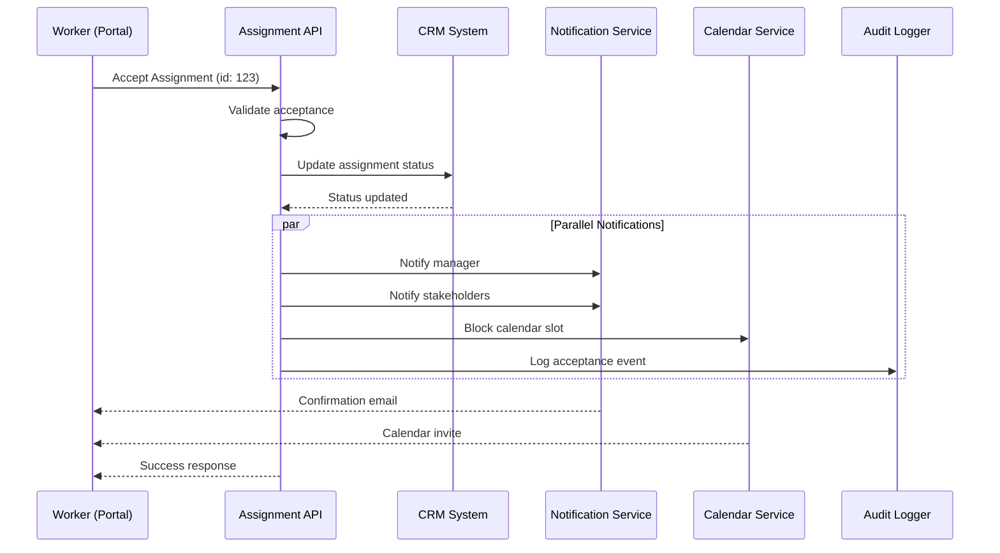

This is an **example** of what generated case documentation looks like. Your actual output will be based on your codebase.

---

## Overview

This case documents the inter-system interactions when an assignee accepts a work assignment. Multiple systems coordinate to update status, notify stakeholders, and prepare the work environment.

**Systems Involved:**
- **CRM System** - Customer relationship management
- **Assignment Portal** - Worker-facing interface
- **Notification Service** - Email and push notifications
- **Calendar Service** - Schedule management
- **Audit Logger** - Compliance tracking

---

## System Interaction Diagram



---

## Step-by-Step Flow

<Steps>
  <Step title="Worker Initiates Acceptance">
    Worker clicks "Accept" in the Assignment Portal. The portal sends a POST request to `/api/assignments/123/accept` with the worker's authentication token.
  </Step>

  <Step title="API Validates Request">
    The Assignment API validates:
    - Worker has permission to accept this assignment
    - Assignment is in `pending` status
    - Worker doesn't have conflicting assignments
    - Deadline hasn't passed
  </Step>

  <Step title="CRM Status Update">
    The API calls the CRM system's internal endpoint to update the assignment status from `pending` to `accepted`. The CRM returns the updated record with timestamp.
  </Step>

  <Step title="Parallel System Updates">
    Four operations happen simultaneously:
    
    **Notification Service:**
    - Sends email to project manager
    - Sends email to other stakeholders
    - Queues push notification for mobile app
    
    **Calendar Service:**
    - Creates calendar block for estimated duration
    - Sends calendar invite to worker
    
    **Audit Logger:**
    - Records acceptance with full context
    - Includes worker ID, timestamp, IP address
  </Step>

  <Step title="Response to Worker">
    Worker receives:
    - API success response with assignment details
    - Confirmation email
    - Calendar invite (if email-based calendar)
    - Push notification on mobile app
  </Step>
</Steps>

---

## API Contracts

### Accept Assignment Endpoint

**Request:**
```http
POST /api/assignments/123/accept
Authorization: Bearer {token}
Content-Type: application/json

{
  "estimated_hours": 8,
  "notes": "Will start tomorrow morning"
}
```

**Success Response:**
```json
{
  "success": true,
  "data": {
    "id": 123,
    "status": "accepted",
    "accepted_at": "2024-01-15T10:30:00Z",
    "accepted_by": {
      "id": 456,
      "name": "John Worker"
    }
  }
}
```

**Error Response:**
```json
{
  "success": false,
  "error": {
    "code": "ASSIGNMENT_ALREADY_ACCEPTED",
    "message": "This assignment has already been accepted by another worker"
  }
}
```

---

## Error Scenarios

<AccordionGroup>
  <Accordion title="CRM System Unavailable">
    **Scenario:** CRM system is down or times out
    
    **Handling:**
    - Retry 3 times with exponential backoff
    - If all retries fail, queue for later processing
    - Return partial success to worker
    - Alert ops team via PagerDuty
    
    **Recovery:**
    - Background job retries every 5 minutes
    - Worker can still see assignment as "acceptance pending"
    - CRM sync completes when service recovers
  </Accordion>

  <Accordion title="Calendar Service Failure">
    **Scenario:** Calendar invite cannot be sent
    
    **Handling:**
    - Log error but don't fail the acceptance
    - Assignment proceeds without calendar block
    - Worker notified to manually add calendar event
    
    **Recovery:**
    - Admin can trigger manual calendar sync
    - Worker can request new invite from settings
  </Accordion>

  <Accordion title="Duplicate Acceptance Race Condition">
    **Scenario:** Two workers accept simultaneously
    
    **Handling:**
    - Database-level optimistic locking
    - First request wins
    - Second request receives conflict error
    
    **Prevention:**
    - Assignment shows "being accepted" status briefly
    - UI disables accept button during processing
  </Accordion>
</AccordionGroup>

---

## Monitoring & Alerts

| Metric | Threshold | Alert |
|--------|-----------|-------|
| Acceptance latency | > 5 seconds | Warning to Slack |
| CRM sync failures | > 5% in 5 min | PagerDuty alert |
| Notification failures | > 10% in 10 min | Email to ops |
| Calendar failures | > 20% in 1 hour | Dashboard warning |

---

## Related Documentation

<CardGroup cols={2}>
  <Card title="Assignment Creation" href="/logic/assignment-creation">
    How assignments are created before acceptance
  </Card>
  <Card title="Assignment Completion" href="/logic/assignment-completion">
    Flow when worker completes the assignment
  </Card>
  <Card title="Assignments Domain" href="/domains/assignments">
    Technical reference for the Assignments domain
  </Card>
  <Card title="Notification Service" href="/domains/notifications">
    How the notification system works
  </Card>
</CardGroup>


