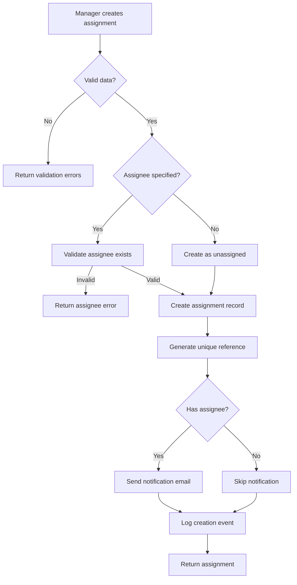

This is an **example** of what generated business logic documentation looks like. Your actual output will be based on your codebase.

---

## Het Doel

When a project manager needs to delegate work, they create an assignment. This process ensures the task is properly documented, the right person is notified, and the work can be tracked through completion.

**In simple terms:** A manager creates a task → the system validates it → assigns it to someone → sends them a notification → tracks until done.

---

## De Flow

---

## Business Regels & Validaties

<AccordionGroup>
  <Accordion title="Title Requirements">
    **Rule:** Title must be between 5-200 characters
    
    **Implementation:** Validated in `CreateAssignmentDTO` using Laravel validation rules
    
    **Consequence:** Returns 422 validation error if violated
  </Accordion>

  <Accordion title="Deadline Constraints">
    **Rule:** Deadline must be at least 1 hour in the future
    
    **Implementation:** Custom validation rule `AfterNowRule`
    
    **Consequence:** Cannot create assignments with past deadlines
  </Accordion>

  <Accordion title="Assignee Permissions">
    **Rule:** Assignee must belong to the same organization as the creator
    
    **Implementation:** Policy check in `CreateAssignmentAction`
    
    **Consequence:** Returns 403 if assignee is from different organization
  </Accordion>

  <Accordion title="Priority Escalation">
    **Rule:** Urgent priority requires manager approval if deadline < 24 hours
    
    **Implementation:** Event listener triggers approval workflow
    
    **Consequence:** Assignment created in `pending_approval` status
  </Accordion>
</AccordionGroup>

---

## Edge Cases

<Warning>
**What if the assignee is on vacation?**

The system checks the user's availability status. If on vacation:
- Assignment is created but flagged
- Backup assignee is notified if configured
- Manager receives warning notification
</Warning>

<Warning>
**What if duplicate assignment exists?**

The system performs fuzzy matching on title + assignee within last 24 hours:
- 90%+ match: Returns warning, requires confirmation
- Creates anyway if user confirms
</Warning>

<Warning>
**What if notification fails?**

Email notifications are queued and retried:
- 3 retry attempts with exponential backoff
- Falls back to in-app notification
- Logged for admin review if all fail
</Warning>

---

## QA & Test Scenario's

### Happy Path

| Scenario | Input | Expected Result |
|----------|-------|-----------------|
| Create basic assignment | Valid title, description, deadline | Assignment created, ID returned |
| Create with assignee | Valid data + assignee_id | Assignment created, email sent |
| Create urgent priority | priority: "urgent" | Assignment created, escalation triggered |

### Edge Cases

| Scenario | Input | Expected Result |
|----------|-------|-----------------|
| Empty title | title: "" | 422 error, validation message |
| Past deadline | deadline: yesterday | 422 error, "must be in future" |
| Invalid assignee | assignee_id: 99999 | 404 error, "user not found" |
| Assignee on vacation | Valid assignee on leave | Created with warning flag |
| Duplicate detection | Same title within 24h | Warning returned, confirmation needed |

### Permission Tests

| Scenario | User Role | Expected Result |
|----------|-----------|-----------------|
| Manager creates | Manager | Success |
| Employee creates | Employee | Success (own assignments only) |
| Guest creates | Guest | 403 Forbidden |
| Cross-org assignee | Manager | 403 Forbidden |

---

## Betrokken Code

<CardGroup cols={2}>
  <Card title="CreateAssignmentAction" href="/domains/assignments#createassignmentaction">
    Main action class that orchestrates the creation
  </Card>
  <Card title="CreateAssignmentDTO" href="/domains/assignments#createassignmentdto">
    Data transfer object with validation rules
  </Card>
  <Card title="Assignment Model" href="/domains/assignments#assignment-model">
    Eloquent model with relationships
  </Card>
  <Card title="AssignmentPolicy" href="/domains/assignments#policies">
    Authorization policy for assignments
  </Card>
</CardGroup>

