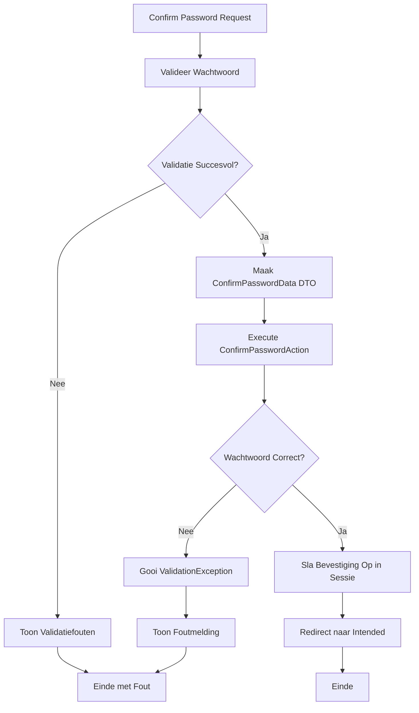

## Het Doel

Wanneer een gebruiker een gevoelige actie wil uitvoeren (zoals account verwijderen), moet het wachtwoord worden bevestigd. Het systeem:

1. Valideert het ingevoerde wachtwoord
2. Verifieert dat wachtwoord overeenkomt met ingelogde gebruiker
3. Slaat bevestiging timestamp op in sessie
4. Staat toe dat gevoelige actie wordt uitgevoerd

Dit proces zorgt ervoor dat alleen geautoriseerde gebruikers gevoelige acties kunnen uitvoeren, zelfs als ze al ingelogd zijn.

## De Flow



## Business Regels & Validaties

<AccordionGroup>
<Accordion title="Regel 1: Wachtwoord Verplicht">
Wachtwoord is verplicht en mag niet leeg zijn.

**Implementatie:**
```php src/Domain/Auth/Data/ConfirmPasswordData.php
#[Required]
public string $password,
```

**Consequentie:**
- Lege wachtwoorden worden afgewezen
- Wachtwoord moet worden ingevoerd
</Accordion>

<Accordion title="Regel 2: Wachtwoord Verificatie">
Wachtwoord moet overeenkomen met ingelogde gebruiker.

**Implementatie:**
```php src/Domain/Auth/Actions/ConfirmPasswordAction.php
if (! Auth::guard('web')->validate([
    'email' => $user->email,
    'password' => $confirmPasswordData->password,
])) {
    throw ValidationException::withMessages([
        'password' => __('auth.password'),
    ]);
}
```

**Consequentie:**
- Onjuiste wachtwoorden worden afgewezen
- Alleen correct wachtwoord geeft toegang
</Accordion>

<Accordion title="Regel 3: Sessie Bevestiging">
Bevestiging timestamp wordt opgeslagen in sessie.

**Implementatie:**
```php src/App/Portal/Auth/Controllers/ConfirmablePasswordController.php
$request->session()->put('auth.password_confirmed_at', time());
```

**Consequentie:**
- Andere controllers kunnen bevestiging status checken
- Bevestiging blijft geldig voor sessie duur
</Accordion>
</AccordionGroup>

## Edge Cases

<Warning>
**Wat als gebruiker niet ingelogd is?**
Controller checkt of gebruiker bestaat. Als niet ingelogd, wordt redirect naar login. ConfirmPasswordAction wordt niet uitgevoerd.
</Warning>

<Warning>
**Wat als wachtwoord incorrect is?**
ValidationException wordt gegooid met foutmelding. Bevestiging wordt niet opgeslagen. Gebruiker blijft op confirm pagina.
</Warning>

<Warning>
**Wat als sessie storage faalt?**
Als sessie put() faalt, wordt exception gegooid. Bevestiging wordt niet opgeslagen. Gebruiker ziet server error.
</Warning>
</AccordionGroup>

## QA & Test Scenario's

### Happy Path

**Scenario:** Gebruiker bevestigt wachtwoord met correct wachtwoord
- **Verwachting:**
  - Wachtwoord wordt gevalideerd
  - ConfirmPasswordData DTO wordt aangemaakt
  - ConfirmPasswordAction verifieert wachtwoord
  - Bevestiging wordt opgeslagen in sessie
  - Gebruiker wordt doorgestuurd naar intended URL
  - Gevoelige acties kunnen nu worden uitgevoerd

### Edge Case 1: Incorrect Wachtwoord

**Scenario:** Gebruiker voert verkeerd wachtwoord in
- **Verwachting:**
  - Request validatie slaagt
  - ConfirmPasswordData DTO wordt aangemaakt
  - ConfirmPasswordAction verificatie faalt
  - ValidationException wordt gegooid
  - Foutmelding wordt getoond: "The password is incorrect"
  - Bevestiging wordt niet opgeslagen
  - Gebruiker blijft op confirm pagina

### Edge Case 2: Leeg Wachtwoord

**Scenario:** Gebruiker laat wachtwoord veld leeg
- **Verwachting:**
  - Validatie faalt op password veld
  - Foutmelding wordt getoond: "The password field is required"
  - ConfirmPasswordAction wordt niet uitgevoerd
  - Bevestiging wordt niet opgeslagen
  - Gebruiker blijft op confirm pagina

## Aanroep Locaties

<CardGroup cols={2}>
<Card title="Portal Controller" icon="code">
  **Controller:**
  ```php
  src/App/Portal/Auth/Controllers/ConfirmablePasswordController.php
  ```
  
  **Methode:** `store()`
  
  **Route:** `POST /confirm-password`
  
  **Guard:** `web` (auth middleware)
</Card>
</CardGroup>

## Betrokken Code

<CardGroup cols={2}>
<Card title="ConfirmPasswordAction" icon="code" href="/domains/auth#confirmpasswordaction">
  De Action die de wachtwoord bevestiging uitvoert
</Card>

<Card title="ConfirmPasswordData" icon="code" href="/domains/auth#confirmpassworddata">
  DTO voor bevestiging gegevens
</Card>

<Card title="Auth Domain" icon="sitemap" href="/domains/auth">
  Volledige documentatie van het Auth domein
</Card>
</CardGroup>

