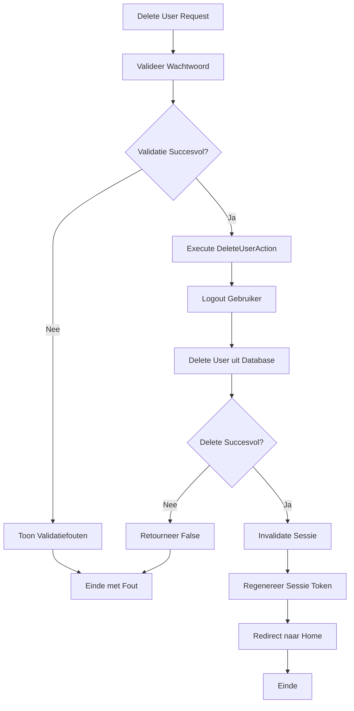

## Het Doel

Wanneer een gebruiker zijn account wil verwijderen, gebeurt er meer dan alleen het verwijderen uit de database. Het systeem:

1. Verifieert dat gebruiker is ingelogd
2. Valideert dat huidige wachtwoord correct is (via middleware/controller)
3. Logt de gebruiker uit
4. Verwijdert de gebruiker uit de database
5. Invalidates en regenereert sessie tokens
6. Redirect naar home pagina

Dit proces zorgt ervoor dat gebruikers veilig hun account kunnen verwijderen en dat alle sessies worden beëindigd.

## De Flow



## Business Regels & Validaties

<AccordionGroup>
<Accordion title="Regel 1: Wachtwoord Verificatie Vereist">
Huidige wachtwoord moet worden geverifieerd voordat verwijdering.

**Implementatie:**
```php src/App/Portal/Settings/Controllers/ProfileController.php
$request->validate([
    'password' => ['required', 'current_password'],
]);
```

**Consequentie:**
- Onjuiste wachtwoorden worden afgewezen
- Beveiliging tegen ongeautoriseerde verwijderingen
</Accordion>

<Accordion title="Regel 2: Automatische Logout">
Gebruiker wordt automatisch uitgelogd voordat verwijdering.

**Implementatie:**
```php src/Domain/User/Actions/DeleteUserAction.php
Auth::logout();
```

**Consequentie:**
- Alle actieve sessies worden beëindigd
- Gebruiker kan niet meer inloggen na verwijdering
</Accordion>

<Accordion title="Regel 3: Database Verwijdering">
User wordt permanent verwijderd uit database.

**Implementatie:**
```php src/Domain/User/Actions/DeleteUserAction.php
return $user->delete() ?? false;
```

**Consequentie:**
- User record wordt permanent verwijderd
- Soft deletes worden niet gebruikt (hard delete)
</Accordion>

<Accordion title="Regel 4: Sessie Invalidatie">
Sessie wordt geïnvalideerd en token wordt geregenereerd.

**Implementatie:**
```php src/App/Portal/Settings/Controllers/ProfileController.php
$request->session()->invalidate();
$request->session()->regenerateToken();
```

**Consequentie:**
- Alle sessie data wordt gewist
- CSRF token wordt geregenereerd
- Beveiliging tegen sessie hergebruik
</Accordion>
</AccordionGroup>

## Edge Cases

<Warning>
**Wat als wachtwoord verificatie faalt?**
Validatie faalt op password veld. Foutmelding wordt getoond: "The password is incorrect" of "The password field is required". DeleteUserAction wordt niet uitgevoerd. Account wordt niet verwijderd.
</Warning>

<Warning>
**Wat als gebruiker niet ingelogd is?**
Controller checkt authenticatie. Als niet ingelogd, wordt redirect naar login. DeleteUserAction wordt niet uitgevoerd. Account wordt niet verwijderd.
</Warning>

<Warning>
**Wat als database delete faalt?**
Als User delete() faalt, wordt false geretourneerd. Gebruiker ziet mogelijk geen foutmelding. Account wordt niet verwijderd. Gebruiker blijft ingelogd.
</Warning>

<Warning>
**Wat als logout faalt?**
Als Auth::logout() faalt, wordt exception gegooid. Delete wordt mogelijk niet uitgevoerd. Gebruiker ziet server error.
</Warning>

<Warning>
**Wat als er foreign key constraints zijn?**
Als User relaties heeft met andere tabellen en foreign key constraints actief zijn, kan delete falen. Database error wordt getoond. Account wordt niet verwijderd.
</Warning>
</AccordionGroup>

## QA & Test Scenario's

### Happy Path

**Scenario:** Gebruiker verwijdert account met correct wachtwoord
- **Verwachting:**
  - Wachtwoord wordt gevalideerd
  - DeleteUserAction wordt uitgevoerd
  - Gebruiker wordt uitgelogd
  - User wordt verwijderd uit database
  - Sessie wordt geïnvalideerd
  - Token wordt geregenereerd
  - Gebruiker wordt doorgestuurd naar home pagina
  - Account bestaat niet meer
  - Gebruiker kan niet meer inloggen

### Edge Case 1: Incorrect Wachtwoord

**Scenario:** Gebruiker voert verkeerd wachtwoord in
- **Verwachting:**
  - Validatie faalt op password veld
  - Foutmelding wordt getoond: "The password is incorrect"
  - DeleteUserAction wordt niet uitgevoerd
  - Account wordt niet verwijderd
  - Gebruiker blijft ingelogd
  - Gebruiker blijft op profile pagina

### Edge Case 2: Leeg Wachtwoord

**Scenario:** Gebruiker laat wachtwoord veld leeg
- **Verwachting:**
  - Validatie faalt op password veld
  - Foutmelding wordt getoond: "The password field is required"
  - DeleteUserAction wordt niet uitgevoerd
  - Account wordt niet verwijderd
  - Gebruiker blijft ingelogd
  - Gebruiker blijft op profile pagina

### Edge Case 3: Database Delete Fout

**Scenario:** Database delete faalt (bijv. foreign key constraint)
- **Verwachting:**
  - Wachtwoord wordt gevalideerd
  - DeleteUserAction wordt uitgevoerd
  - Gebruiker wordt uitgelogd
  - User delete() faalt
  - False wordt geretourneerd
  - Mogelijk database error wordt getoond
  - Account wordt mogelijk niet verwijderd (afhankelijk van error handling)

## Aanroep Locaties

<CardGroup cols={2}>
<Card title="Portal Controller" icon="code">
  **Controller:**
  ```php
  src/App/Portal/Settings/Controllers/ProfileController.php
  ```
  
  **Methode:** `destroy()`
  
  **Route:** `DELETE /profile`
  
  **Guard:** `web` (auth middleware)
</Card>
</CardGroup>

## Betrokken Code

<CardGroup cols={2}>
<Card title="DeleteUserAction" icon="code" href="/domains/user#deleteuseraction">
  De Action die de gebruiker verwijdering uitvoert
</Card>

<Card title="User Domain" icon="sitemap" href="/domains/user">
  Volledige documentatie van het User domein
</Card>
</CardGroup>
