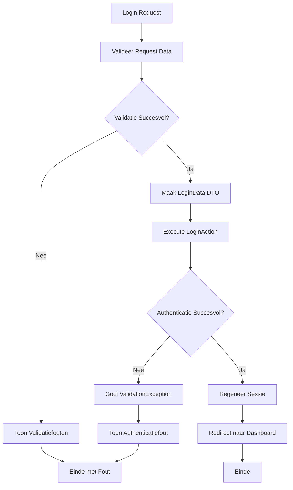

## Het Doel

Wanneer een gebruiker inlogt, gebeurt er meer dan alleen authenticatie. Het systeem:

1. Valideert de inloggegevens (e-mail en wachtwoord)
2. Verifieert de gebruiker via Laravel Auth
3. Regeneert de sessie voor beveiliging
4. Redirect naar het dashboard of de oorspronkelijke bestemming

Dit proces zorgt ervoor dat gebruikers veilig kunnen inloggen en dat hun sessie beveiligd is tegen session fixation aanvallen.

## De Flow



## Business Regels & Validaties

<AccordionGroup>
<Accordion title="Regel 1: E-mail Validatie">
E-mail moet een geldig e-mail formaat zijn en verplicht zijn.

**Implementatie:**
```php src/Domain/Auth/Data/LoginData.php
#[Required, Email]
public string $email,
```

**Consequentie:**
- Ongeldige e-mail formaten worden afgewezen
- Lege e-mail velden worden afgewezen
</Accordion>

<Accordion title="Regel 2: Wachtwoord Verplicht">
Wachtwoord is verplicht en mag niet leeg zijn.

**Implementatie:**
```php src/Domain/Auth/Data/LoginData.php
#[Required]
public string $password,
```

**Consequentie:**
- Lege wachtwoorden worden afgewezen
- Authenticatie vereist beide velden
</Accordion>

<Accordion title="Regel 3: Authenticatie Verificatie">
E-mail en wachtwoord moeten overeenkomen met een bestaande gebruiker.

**Implementatie:**
```php src/Domain/Auth/Actions/LoginAction.php
if (! Auth::attempt($loginData->except('remember')->toArray(), $loginData->remember)) {
    throw ValidationException::withMessages([
        'email' => trans('auth.failed'),
    ]);
}
```

**Consequentie:**
- Onjuiste credentials resulteren in authenticatiefout
- Foutmelding wordt getoond zonder te verklappen of e-mail bestaat
</Accordion>

<Accordion title="Regel 4: Remember Me Functionaliteit">
Gebruiker kan optioneel "remember me" selecteren voor langere sessie.

**Implementatie:**
```php src/Domain/Auth/Data/LoginData.php
public bool $remember = false,
```

**Consequentie:**
- Als remember = true, blijft gebruiker langer ingelogd
- Remember token wordt opgeslagen in database
</Accordion>

<Accordion title="Regel 5: Sessie Regeneratie">
Sessie wordt altijd geregenereerd na succesvolle login voor beveiliging.

**Implementatie:**
```php src/App/Portal/Auth/Controllers/AuthenticatedSessionController.php
$request->session()->regenerate();
```

**Consequentie:**
- Voorkomt session fixation aanvallen
- Oude sessie wordt ongeldig gemaakt
</Accordion>

<Accordion title="Regel 6: Redirect naar Intended">
Gebruiker wordt doorgestuurd naar oorspronkelijke bestemming of dashboard.

**Implementatie:**
```php src/App/Portal/Auth/Controllers/AuthenticatedSessionController.php
return redirect()->intended(route('dashboard', absolute: false));
```

**Consequentie:**
- Gebruiker gaat naar waar hij/zij naartoe wilde
- Fallback naar dashboard als er geen intended URL is
</Accordion>
</AccordionGroup>

## Edge Cases

<Warning>
**Wat als de gebruiker al ingelogd is?**
De route is beveiligd met 'guest' middleware, dus ingelogde gebruikers worden automatisch doorgestuurd. Als middleware faalt, kan gebruiker nog steeds inloggen maar wordt niet opnieuw ingelogd.
</Warning>

<Warning>
**Wat als de e-mail niet bestaat?**
Het systeem toont dezelfde foutmelding als bij verkeerd wachtwoord ("These credentials do not match our records") om te voorkomen dat aanvallers kunnen achterhalen welke e-mails geregistreerd zijn.
</Warning>

<Warning>
**Wat als de sessie storage faalt?**
Als sessie regeneratie faalt, wordt de login nog steeds uitgevoerd maar zonder sessie beveiliging. Dit is zeldzaam maar kan voorkomen bij storage problemen.
</Warning>

<Warning>
**Wat als de gebruiker account is gedeactiveerd?**
Laravel Auth controleert standaard niet op account status. Als je soft deletes of account status gebruikt, moet dit handmatig worden gecontroleerd in de Action.
</Warning>

<Warning>
**Wat als er rate limiting is?**
Rate limiting wordt meestal afgehandeld door middleware. Als dit faalt, kan de Action nog steeds worden uitgevoerd. Controleer rate limiting middleware configuratie.
</Warning>

## QA & Test Scenario's

### Happy Path

**Scenario:** Gebruiker logt in met geldige credentials
- **Verwachting:**
  - Request wordt gevalideerd
  - LoginData DTO wordt aangemaakt
  - LoginAction authenticeert gebruiker succesvol
  - Sessie wordt geregenereerd
  - Gebruiker wordt doorgestuurd naar dashboard
  - Gebruiker is ingelogd

### Edge Case 1: Ongeldig E-mail Formaat

**Scenario:** Gebruiker probeert in te loggen met ongeldig e-mail formaat
- **Verwachting:**
  - Validatie faalt op e-mail veld
  - Foutmelding wordt getoond: "The email must be a valid email address"
  - LoginAction wordt niet uitgevoerd
  - Gebruiker blijft op login pagina

### Edge Case 2: Verkeerd Wachtwoord

**Scenario:** Gebruiker logt in met correcte e-mail maar verkeerd wachtwoord
- **Verwachting:**
  - Request validatie slaagt
  - LoginData DTO wordt aangemaakt
  - LoginAction authenticatie faalt
  - ValidationException wordt gegooid met "These credentials do not match our records"
  - Foutmelding wordt getoond
  - Gebruiker blijft op login pagina

### Edge Case 3: Onbestaande E-mail

**Scenario:** Gebruiker logt in met e-mail die niet bestaat
- **Verwachting:**
  - Request validatie slaagt
  - LoginData DTO wordt aangemaakt
  - LoginAction authenticatie faalt
  - ValidationException wordt gegooid met zelfde foutmelding als verkeerd wachtwoord
  - Foutmelding wordt getoond zonder te verklappen of e-mail bestaat
  - Gebruiker blijft op login pagina

### Edge Case 4: Remember Me Actief

**Scenario:** Gebruiker logt in met "remember me" checkbox aangevinkt
- **Verwachting:**
  - Request validatie slaagt
  - LoginData DTO wordt aangemaakt met remember = true
  - LoginAction authenticeert met remember token
  - Sessie wordt geregenereerd
  - Remember token wordt opgeslagen
  - Gebruiker blijft langer ingelogd
  - Gebruiker wordt doorgestuurd naar dashboard

### Edge Case 5: Lege Velden

**Scenario:** Gebruiker probeert in te loggen zonder e-mail of wachtwoord
- **Verwachting:**
  - Validatie faalt op verplichte velden
  - Foutmeldingen worden getoond: "The email field is required" en "The password field is required"
  - LoginAction wordt niet uitgevoerd
  - Gebruiker blijft op login pagina

## Aanroep Locaties

<CardGroup cols={2}>
<Card title="Portal Controller" icon="code">
  **Controller:**
  ```php
  src/App/Portal/Auth/Controllers/AuthenticatedSessionController.php
  ```
  
  **Methode:** `store()`
  
  **Route:** `POST /login`
  
  **Guard:** `web` (guest middleware)
</Card>

<Card title="Implementatie" icon="code">
  ```php
  public function store(Request $request): RedirectResponse
  {
      $request->validate([
          'email' => 'required|email',
          'password' => 'required',
      ]);
      
      $loginData = LoginData::from($request->all());
      app(LoginAction::class)($loginData);
      $request->session()->regenerate();
      
      return redirect()->intended(route('dashboard', absolute: false));
  }
  ```
</Card>
</CardGroup>

## Betrokken Code

<CardGroup cols={2}>
<Card title="LoginAction" icon="code" href="/domains/auth#loginaction">
  De Action die de authenticatie uitvoert
</Card>

<Card title="LoginData" icon="code" href="/domains/auth#logindata">
  DTO voor login gegevens
</Card>

<Card title="Auth Domain" icon="sitemap" href="/domains/auth">
  Volledige documentatie van het Auth domein
</Card>

<Card title="AuthenticatedSessionController" icon="code" href="/logic/login#aanroep-locaties">
  Controller die de login flow aanroept
</Card>
</CardGroup>

