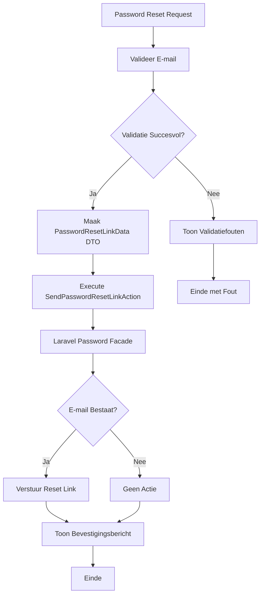

## Het Doel

Wanneer een gebruiker zijn wachtwoord is vergeten, kan hij/zij een reset link aanvragen. Het systeem:

1. Valideert het e-mailadres
2. Verstuurt een wachtwoord reset link via e-mail
3. Toont een bevestigingsbericht (zonder te verklappen of e-mail bestaat)

Dit proces zorgt ervoor dat gebruikers veilig hun wachtwoord kunnen resetten zonder dat het systeem informatie lekt over welke e-mails geregistreerd zijn.

## De Flow



## Business Regels & Validaties

<AccordionGroup>
<Accordion title="Regel 1: E-mail Validatie">
E-mail moet een geldig e-mail formaat zijn.

**Implementatie:**
```php src/Domain/Auth/Data/PasswordResetLinkData.php
#[Required, Email]
public string $email,
```

**Consequentie:**
- Ongeldige e-mail formaten worden afgewezen
- Lege e-mail velden worden afgewezen
</Accordion>

<Accordion title="Regel 2: Privacy - Geen Informatie Lekken">
Systeem toont altijd hetzelfde bericht, ongeacht of e-mail bestaat.

**Implementatie:**
```php src/App/Portal/Auth/Controllers/PasswordResetLinkController.php
return back()->with('status', __('A reset link will be sent if the account exists.'));
```

**Consequentie:**
- Aanvallers kunnen niet achterhalen welke e-mails geregistreerd zijn
- Beveiliging tegen enumeration attacks
</Accordion>

<Accordion title="Regel 3: Laravel Password Facade">
Gebruikt Laravel's ingebouwde password reset functionaliteit.

**Implementatie:**
```php src/Domain/Auth/Actions/SendPasswordResetLinkAction.php
$status = Password::sendResetLink($passwordResetLinkData->toArray());
```

**Consequentie:**
- Automatische token generatie
- E-mail wordt verstuurd via geconfigureerde mail driver
- Token wordt opgeslagen in password_resets tabel
</Accordion>
</AccordionGroup>

## Edge Cases

<Warning>
**Wat als de e-mail niet bestaat?**
Het systeem toont hetzelfde bevestigingsbericht als bij bestaande e-mails. Geen reset link wordt verstuurd, maar gebruiker weet dit niet. Dit voorkomt informatie lekken.
</Warning>

<Warning>
**Wat als e-mail service faalt?**
Als Laravel's mail service faalt, wordt een exception gegooid. Gebruiker ziet server error. Reset link wordt niet verstuurd.
</Warning>

<Warning>
**Wat als er al een actieve reset link bestaat?**
Laravel genereert een nieuwe token en overschrijft de oude. Oude reset links worden ongeldig. Dit is standaard Laravel gedrag.
</Warning>
</AccordionGroup>

## QA & Test Scenario's

### Happy Path

**Scenario:** Gebruiker vraagt reset link aan met bestaand e-mailadres
- **Verwachting:**
  - E-mail wordt gevalideerd
  - PasswordResetLinkData DTO wordt aangemaakt
  - SendPasswordResetLinkAction verstuurt reset link
  - E-mail wordt ontvangen met reset link
  - Bevestigingsbericht wordt getoond
  - Token wordt opgeslagen in password_resets tabel

### Edge Case 1: Onbestaand E-mail

**Scenario:** Gebruiker vraagt reset link aan met niet-bestaand e-mailadres
- **Verwachting:**
  - E-mail wordt gevalideerd (formaat is geldig)
  - PasswordResetLinkData DTO wordt aangemaakt
  - SendPasswordResetLinkAction wordt uitgevoerd
  - Geen e-mail wordt verstuurd
  - Zelfde bevestigingsbericht wordt getoond
  - Geen informatie lekt over of e-mail bestaat

### Edge Case 2: Ongeldig E-mail Formaat

**Scenario:** Gebruiker gebruikt ongeldig e-mail formaat
- **Verwachting:**
  - Validatie faalt op e-mail veld
  - Foutmelding wordt getoond: "The email must be a valid email address"
  - SendPasswordResetLinkAction wordt niet uitgevoerd
  - Geen e-mail wordt verstuurd
  - Gebruiker blijft op pagina

## Aanroep Locaties

<CardGroup cols={2}>
<Card title="Portal Controller" icon="code">
  **Controller:**
  ```php
  src/App/Portal/Auth/Controllers/PasswordResetLinkController.php
  ```
  
  **Methode:** `store()`
  
  **Route:** `POST /forgot-password`
  
  **Guard:** `web` (guest middleware)
</Card>
</CardGroup>

## Betrokken Code

<CardGroup cols={2}>
<Card title="SendPasswordResetLinkAction" icon="code" href="/domains/auth#sendpasswordresetlinkaction">
  De Action die de reset link verstuurt
</Card>

<Card title="PasswordResetLinkData" icon="code" href="/domains/auth#passwordresetlinkdata">
  DTO voor reset link gegevens
</Card>

<Card title="Auth Domain" icon="sitemap" href="/domains/auth">
  Volledige documentatie van het Auth domein
</Card>
</CardGroup>

