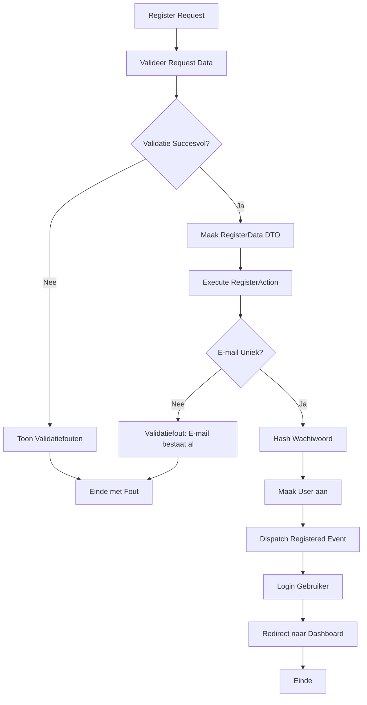

## Het Doel

Wanneer een nieuwe gebruiker zich registreert, gebeurt er meer dan alleen het aanmaken van een account. Het systeem:

1. Valideert alle registratiegegevens (naam, e-mail, wachtwoord)
2. Controleert dat e-mail uniek is
3. Creëert een nieuwe gebruiker met gehasht wachtwoord
4. Dispatched een Registered event
5. Logt de gebruiker automatisch in
6. Redirect naar het dashboard

Dit proces zorgt ervoor dat nieuwe gebruikers veilig kunnen registreren en direct kunnen beginnen met het gebruik van de applicatie.

## De Flow



## Business Regels & Validaties

<AccordionGroup>
<Accordion title="Regel 1: Naam Validatie">
Naam is verplicht en mag maximaal 255 karakters zijn.

**Implementatie:**
```php src/Domain/Auth/Data/RegisterData.php
#[Required, Max(255)]
public string $name,
```

**Consequentie:**
- Lege namen worden afgewezen
- Namen langer dan 255 karakters worden afgewezen
</Accordion>

<Accordion title="Regel 2: E-mail Uniciteit">
E-mail moet uniek zijn en niet al in gebruik zijn.

**Implementatie:**
```php src/Domain/Auth/Data/RegisterData.php
#[Required, Email, Max(255), Unique('users', 'email')]
public string $email,
```

**Consequentie:**
- Bestaande e-mails worden afgewezen
- Database constraint voorkomt duplicaten
</Accordion>

<Accordion title="Regel 3: Wachtwoord Bevestiging">
Wachtwoord moet minimaal 8 karakters zijn en bevestigd worden.

**Implementatie:**
```php src/Domain/Auth/Data/RegisterData.php
#[Required, Min(8), Confirmed]
public string $password,
```

**Consequentie:**
- Korte wachtwoorden worden afgewezen
- Wachtwoord bevestiging moet overeenkomen
</Accordion>

<Accordion title="Regel 4: Wachtwoord Hashing">
Wachtwoord wordt automatisch gehasht voordat opslag.

**Implementatie:**
```php src/Domain/Auth/Actions/RegisterAction.php
'password' => Hash::make($registerData->password),
```

**Consequentie:**
- Wachtwoord wordt nooit in plain text opgeslagen
- Beveiliging tegen data breaches
</Accordion>

<Accordion title="Regel 5: Registered Event">
Na registratie wordt een Registered event gedispatched.

**Implementatie:**
```php src/Domain/Auth/Actions/RegisterAction.php
event(new Registered($user));
```

**Consequentie:**
- Andere delen van het systeem kunnen reageren op registratie
- E-mail verificatie kan worden getriggerd
</Accordion>

<Accordion title="Regel 6: Automatische Login">
Na registratie wordt gebruiker automatisch ingelogd.

**Implementatie:**
```php src/App/Portal/Auth/Controllers/RegisteredUserController.php
Auth::login($user);
```

**Consequentie:**
- Gebruiker hoeft niet handmatig in te loggen na registratie
- Directe toegang tot applicatie
</Accordion>
</AccordionGroup>

## Edge Cases

<Warning>
**Wat als de e-mail al bestaat tijdens registratie?**
De DTO validatie controleert uniciteit. Als e-mail al bestaat, wordt validatiefout getoond: "The email has already been taken". Registratie wordt niet uitgevoerd.
</Warning>

<Warning>
**Wat als wachtwoord bevestiging niet overeenkomt?**
De DTO validatie controleert confirmed rule. Als wachtwoorden niet overeenkomen, wordt validatiefout getoond: "The password confirmation does not match". Registratie wordt niet uitgevoerd.
</Warning>

<Warning>
**Wat als database transactie faalt?**
Als User::create() faalt (bijv. database error), wordt exception gegooid. Gebruiker ziet database foutmelding. Event wordt niet gedispatched.
</Warning>

<Warning>
**Wat als Hash::make() faalt?**
Dit is zeer zeldzaam maar kan voorkomen bij geheugen problemen. Exception wordt gegooid en registratie faalt. Gebruiker ziet server error.
</Warning>

<Warning>
**Wat als Auth::login() faalt?**
Als login na registratie faalt, wordt gebruiker wel aangemaakt maar niet ingelogd. Gebruiker moet handmatig inloggen. Dit is zeldzaam.
</Warning>

## QA & Test Scenario's

### Happy Path

**Scenario:** Nieuwe gebruiker registreert met geldige gegevens
- **Verwachting:**
  - Request wordt gevalideerd
  - RegisterData DTO wordt aangemaakt
  - RegisterAction creëert nieuwe User
  - Wachtwoord wordt gehasht
  - Registered event wordt gedispatched
  - Gebruiker wordt automatisch ingelogd
  - Gebruiker wordt doorgestuurd naar dashboard
  - User bestaat in database

### Edge Case 1: Bestaande E-mail

**Scenario:** Gebruiker probeert te registreren met e-mail die al bestaat
- **Verwachting:**
  - Validatie faalt op e-mail veld
  - Foutmelding wordt getoond: "The email has already been taken"
  - RegisterAction wordt niet uitgevoerd
  - Geen nieuwe User wordt aangemaakt
  - Gebruiker blijft op registratie pagina

### Edge Case 2: Wachtwoord Bevestiging Mismatch

**Scenario:** Gebruiker vult verschillende wachtwoorden in
- **Verwachting:**
  - Validatie faalt op password veld
  - Foutmelding wordt getoond: "The password confirmation does not match"
  - RegisterAction wordt niet uitgevoerd
  - Geen nieuwe User wordt aangemaakt
  - Gebruiker blijft op registratie pagina

### Edge Case 3: Te Kort Wachtwoord

**Scenario:** Gebruiker gebruikt wachtwoord korter dan 8 karakters
- **Verwachting:**
  - Validatie faalt op password veld
  - Foutmelding wordt getoond: "The password must be at least 8 characters"
  - RegisterAction wordt niet uitgevoerd
  - Geen nieuwe User wordt aangemaakt
  - Gebruiker blijft op registratie pagina

### Edge Case 4: Ongeldig E-mail Formaat

**Scenario:** Gebruiker gebruikt ongeldig e-mail formaat
- **Verwachting:**
  - Validatie faalt op e-mail veld
  - Foutmelding wordt getoond: "The email must be a valid email address"
  - RegisterAction wordt niet uitgevoerd
  - Geen nieuwe User wordt aangemaakt
  - Gebruiker blijft op registratie pagina

### Edge Case 5: Lege Verplichte Velden

**Scenario:** Gebruiker laat verplichte velden leeg
- **Verwachting:**
  - Validatie faalt op alle verplichte velden
  - Foutmeldingen worden getoond voor elk leeg veld
  - RegisterAction wordt niet uitgevoerd
  - Geen nieuwe User wordt aangemaakt
  - Gebruiker blijft op registratie pagina

## Aanroep Locaties

<CardGroup cols={2}>
<Card title="Portal Controller" icon="code">
  **Controller:**
  ```php
  src/App/Portal/Auth/Controllers/RegisteredUserController.php
  ```
  
  **Methode:** `store()`
  
  **Route:** `POST /register`
  
  **Guard:** `web` (guest middleware)
</Card>

<Card title="Implementatie" icon="code">
  ```php
  public function store(Request $request): RedirectResponse
  {
      $request->validate([
          'name' => 'required|string|max:255',
          'email' => 'required|string|lowercase|email|max:255|unique:users',
          'password' => ['required', 'confirmed', Rules\Password::defaults()],
      ]);
      
      $registerData = RegisterData::from($request->all());
      $user = app(RegisterAction::class)($registerData);
      Auth::login($user);
      
      return to_route('dashboard');
  }
  ```
</Card>
</CardGroup>

## Betrokken Code

<CardGroup cols={2}>
<Card title="RegisterAction" icon="code" href="/domains/auth#registeraction">
  De Action die de registratie uitvoert
</Card>

<Card title="RegisterData" icon="code" href="/domains/auth#registerdata">
  DTO voor registratie gegevens
</Card>

<Card title="Auth Domain" icon="sitemap" href="/domains/auth">
  Volledige documentatie van het Auth domein
</Card>

<Card title="User Model" icon="code" href="/domains/user">
  User model dat wordt aangemaakt
</Card>
</CardGroup>


