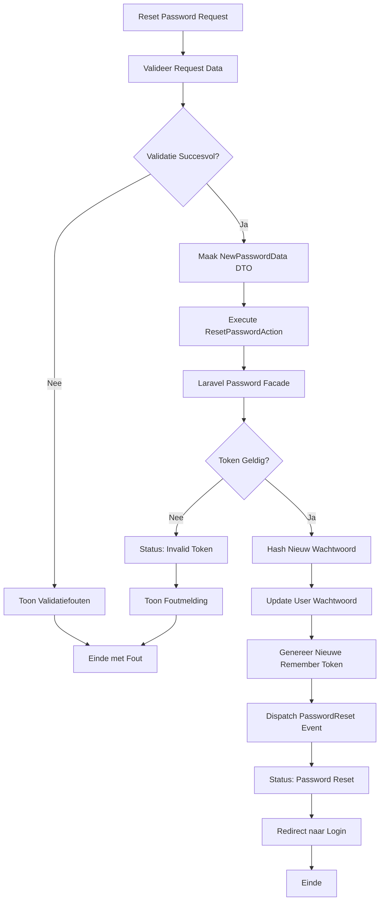

## Het Doel

Wanneer een gebruiker zijn wachtwoord reset met een token, gebeurt er meer dan alleen het updaten van het wachtwoord. Het systeem:

1. Valideert token, e-mail en nieuw wachtwoord
2. Verifieert dat token geldig is en bij e-mail hoort
3. Hasht het nieuwe wachtwoord
4. Update het wachtwoord in de database
5. Genereert nieuwe remember token
6. Dispatched PasswordReset event
7. Redirect naar login pagina

Dit proces zorgt ervoor dat gebruikers veilig hun wachtwoord kunnen resetten na het ontvangen van een reset link.

## De Flow



## Business Regels & Validaties

<AccordionGroup>
<Accordion title="Regel 1: Token Verplicht">
Reset token is verplicht en moet geldig zijn.

**Implementatie:**
```php src/Domain/Auth/Data/NewPasswordData.php
#[Required]
public string $token,
```

**Consequentie:**
- Lege tokens worden afgewezen
- Ongeldige tokens worden afgewezen
</Accordion>

<Accordion title="Regel 2: E-mail Validatie">
E-mail moet geldig zijn en overeenkomen met token.

**Implementatie:**
```php src/Domain/Auth/Data/NewPasswordData.php
#[Required, Email]
public string $email,
```

**Consequentie:**
- Ongeldige e-mails worden afgewezen
- E-mail moet overeenkomen met token
</Accordion>

<Accordion title="Regel 3: Wachtwoord Bevestiging">
Nieuw wachtwoord moet minimaal 8 karakters zijn en bevestigd worden.

**Implementatie:**
```php src/Domain/Auth/Data/NewPasswordData.php
#[Required, Min(8), Confirmed]
public string $password,
```

**Consequentie:**
- Korte wachtwoorden worden afgewezen
- Wachtwoord bevestiging moet overeenkomen
</Accordion>

<Accordion title="Regel 4: Token Verificatie">
Token moet geldig zijn en bij e-mail horen.

**Implementatie:**
```php src/Domain/Auth/Actions/ResetPasswordAction.php
$status = Password::reset(
    $newPasswordData->toArray(),
    function ($user) use ($newPasswordData) {
        // Update password
    }
);
```

**Consequentie:**
- Ongeldige tokens worden afgewezen
- Verlopen tokens worden afgewezen
- Token moet bij e-mail horen
</Accordion>

<Accordion title="Regel 5: Wachtwoord Hashing">
Nieuw wachtwoord wordt automatisch gehasht.

**Implementatie:**
```php src/Domain/Auth/Actions/ResetPasswordAction.php
'password' => Hash::make($newPasswordData->password),
```

**Consequentie:**
- Wachtwoord wordt nooit in plain text opgeslagen
- Beveiliging tegen data breaches
</Accordion>

<Accordion title="Regel 6: Remember Token Regeneratie">
Nieuwe remember token wordt gegenereerd na reset.

**Implementatie:**
```php src/Domain/Auth/Actions/ResetPasswordAction.php
'remember_token' => Str::random(60),
```

**Consequentie:**
- Oude remember tokens worden ongeldig
- Beveiliging tegen token hergebruik
</Accordion>

<Accordion title="Regel 7: PasswordReset Event">
Na succesvolle reset wordt PasswordReset event gedispatched.

**Implementatie:**
```php src/Domain/Auth/Actions/ResetPasswordAction.php
event(new PasswordReset($user));
```

**Consequentie:**
- Andere delen van het systeem kunnen reageren op reset
- Logging kan worden getriggerd
</Accordion>
</AccordionGroup>

## Edge Cases

<Warning>
**Wat als de token ongeldig is?**
Als token ongeldig, verlopen, of niet bij e-mail hoort, wordt status PASSWORD_RESET_THROTTLED of INVALID_TOKEN geretourneerd. Foutmelding wordt getoond. Wachtwoord wordt niet gereset.
</Warning>

<Warning>
**Wat als de token is verlopen?**
Laravel tokens hebben een standaard expiry tijd. Verlopen tokens worden afgewezen. Gebruiker moet nieuwe reset link aanvragen.
</Warning>

<Warning>
**Wat als wachtwoord bevestiging niet overeenkomt?**
Validatie faalt op password veld. Foutmelding wordt getoond: "The password confirmation does not match". Reset wordt niet uitgevoerd.
</Warning>

<Warning>
**Wat als database update faalt?**
Als User update faalt, wordt exception gegooid. Gebruiker ziet server error. Wachtwoord wordt niet gereset.
</Warning>

<Warning>
**Wat als Hash::make() faalt?**
Dit is zeer zeldzaam maar kan voorkomen bij geheugen problemen. Exception wordt gegooid en reset faalt. Gebruiker ziet server error.
</Warning>

## QA & Test Scenario's

### Happy Path

**Scenario:** Gebruiker reset wachtwoord met geldige token
- **Verwachting:**
  - Request wordt gevalideerd
  - NewPasswordData DTO wordt aangemaakt
  - ResetPasswordAction verifieert token
  - Wachtwoord wordt gehasht en opgeslagen
  - Nieuwe remember token wordt gegenereerd
  - PasswordReset event wordt gedispatched
  - Gebruiker wordt doorgestuurd naar login pagina
  - Oude wachtwoord werkt niet meer
  - Nieuwe wachtwoord werkt

### Edge Case 1: Ongeldig Token

**Scenario:** Gebruiker gebruikt ongeldig of verlopen token
- **Verwachting:**
  - Request validatie slaagt
  - NewPasswordData DTO wordt aangemaakt
  - ResetPasswordAction verificatie faalt
  - Status INVALID_TOKEN wordt geretourneerd
  - Foutmelding wordt getoond
  - Wachtwoord wordt niet gereset
  - Gebruiker blijft op reset pagina

### Edge Case 2: Token bij Verkeerde E-mail

**Scenario:** Gebruiker gebruikt token met verkeerde e-mail
- **Verwachting:**
  - Request validatie slaagt
  - NewPasswordData DTO wordt aangemaakt
  - ResetPasswordAction verificatie faalt
  - Status INVALID_TOKEN wordt geretourneerd
  - Foutmelding wordt getoond
  - Wachtwoord wordt niet gereset

### Edge Case 3: Wachtwoord Bevestiging Mismatch

**Scenario:** Gebruiker vult verschillende wachtwoorden in
- **Verwachting:**
  - Validatie faalt op password veld
  - Foutmelding wordt getoond: "The password confirmation does not match"
  - ResetPasswordAction wordt niet uitgevoerd
  - Wachtwoord wordt niet gereset
  - Gebruiker blijft op reset pagina

### Edge Case 4: Te Kort Wachtwoord

**Scenario:** Gebruiker gebruikt wachtwoord korter dan 8 karakters
- **Verwachting:**
  - Validatie faalt op password veld
  - Foutmelding wordt getoond: "The password must be at least 8 characters"
  - ResetPasswordAction wordt niet uitgevoerd
  - Wachtwoord wordt niet gereset
  - Gebruiker blijft op reset pagina

## Aanroep Locaties

<CardGroup cols={2}>
<Card title="Portal Controller" icon="code">
  **Controller:**
  ```php
  src/App/Portal/Auth/Controllers/NewPasswordController.php
  ```
  
  **Methode:** `store()`
  
  **Route:** `POST /reset-password`
  
  **Guard:** `web` (guest middleware)
</Card>
</CardGroup>

## Betrokken Code

<CardGroup cols={2}>
<Card title="ResetPasswordAction" icon="code" href="/domains/auth#resetpasswordaction">
  De Action die de wachtwoord reset uitvoert
</Card>

<Card title="NewPasswordData" icon="code" href="/domains/auth#newpassworddata">
  DTO voor reset gegevens
</Card>

<Card title="Auth Domain" icon="sitemap" href="/domains/auth">
  Volledige documentatie van het Auth domein
</Card>
</CardGroup>

