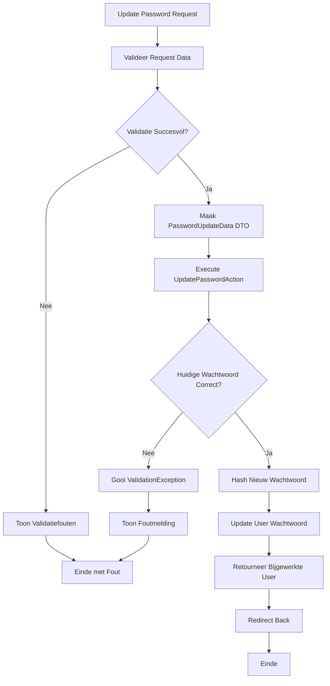

## Het Doel

Wanneer een ingelogde gebruiker zijn wachtwoord wil wijzigen, gebeurt er meer dan alleen het updaten. Het systeem:

1. Valideert huidige wachtwoord, nieuw wachtwoord en bevestiging
2. Verifieert dat huidige wachtwoord correct is
3. Hasht het nieuwe wachtwoord
4. Update het wachtwoord in de database
5. Gebruiker blijft ingelogd met nieuw wachtwoord

Dit proces zorgt ervoor dat gebruikers veilig hun wachtwoord kunnen wijzigen zonder uit te loggen.

## De Flow



## Business Regels & Validaties

<AccordionGroup>
<Accordion title="Regel 1: Huidige Wachtwoord Verificatie">
Huidige wachtwoord moet correct zijn en overeenkomen met opgeslagen wachtwoord.

**Implementatie:**
```php src/Domain/Settings/Actions/UpdatePasswordAction.php
if (! Hash::check($passwordData->currentPassword, $user->password)) {
    throw ValidationException::withMessages([
        'current_password' => ['The provided password does not match your current password.'],
    ]);
}
```

**Consequentie:**
- Onjuiste huidige wachtwoorden worden afgewezen
- Beveiliging tegen ongeautoriseerde wijzigingen
</Accordion>

<Accordion title="Regel 2: Nieuw Wachtwoord Bevestiging">
Nieuw wachtwoord moet minimaal 8 karakters zijn en bevestigd worden.

**Implementatie:**
```php src/Domain/Settings/Data/PasswordUpdateData.php
#[Required, Min(8), Confirmed]
public string $password,
```

**Consequentie:**
- Korte wachtwoorden worden afgewezen
- Wachtwoord bevestiging moet overeenkomen
</Accordion>

<Accordion title="Regel 3: Wachtwoord Hashing">
Nieuw wachtwoord wordt automatisch gehasht.

**Implementatie:**
```php src/Domain/Settings/Actions/UpdatePasswordAction.php
'password' => Hash::make($passwordData->password),
```

**Consequentie:**
- Wachtwoord wordt nooit in plain text opgeslagen
- Beveiliging tegen data breaches
</Accordion>

<Accordion title="Regel 4: Authenticatie Vereist">
Alleen ingelogde gebruikers kunnen wachtwoord wijzigen.

**Implementatie:**
```php src/App/Portal/Settings/Controllers/PasswordController.php
$user = auth()->user();
if (!$user) {
    return redirect()->route('login');
}
```

**Consequentie:**
- Niet-ingelogde gebruikers worden doorgestuurd naar login
- Beveiliging tegen ongeautoriseerde toegang
</Accordion>
</AccordionGroup>

## Edge Cases

<Warning>
**Wat als huidige wachtwoord incorrect is?**
ValidationException wordt gegooid met foutmelding. Wachtwoord wordt niet gewijzigd. Gebruiker blijft op settings pagina.
</Warning>

<Warning>
**Wat als wachtwoord bevestiging niet overeenkomt?**
Validatie faalt op password veld. Foutmelding wordt getoond: "The password confirmation does not match". Update wordt niet uitgevoerd.
</Warning>

<Warning>
**Wat als database update faalt?**
Als User update faalt, wordt exception gegooid. Gebruiker ziet server error. Wachtwoord wordt niet gewijzigd.
</Warning>

<Warning>
**Wat als gebruiker niet ingelogd is?**
Controller checkt authenticatie. Als niet ingelogd, wordt redirect naar login. UpdatePasswordAction wordt niet uitgevoerd.
</Warning>
</AccordionGroup>

## QA & Test Scenario's

### Happy Path

**Scenario:** Gebruiker wijzigt wachtwoord met correcte gegevens
- **Verwachting:**
  - Request wordt gevalideerd
  - PasswordUpdateData DTO wordt aangemaakt
  - UpdatePasswordAction verifieert huidige wachtwoord
  - Nieuw wachtwoord wordt gehasht en opgeslagen
  - Gebruiker blijft ingelogd
  - Redirect naar settings pagina
  - Oude wachtwoord werkt niet meer
  - Nieuwe wachtwoord werkt

### Edge Case 1: Incorrect Huidige Wachtwoord

**Scenario:** Gebruiker voert verkeerd huidige wachtwoord in
- **Verwachting:**
  - Request validatie slaagt
  - PasswordUpdateData DTO wordt aangemaakt
  - UpdatePasswordAction verificatie faalt
  - ValidationException wordt gegooid
  - Foutmelding wordt getoond: "The provided password does not match your current password"
  - Wachtwoord wordt niet gewijzigd
  - Gebruiker blijft op settings pagina

### Edge Case 2: Wachtwoord Bevestiging Mismatch

**Scenario:** Gebruiker vult verschillende nieuwe wachtwoorden in
- **Verwachting:**
  - Validatie faalt op password veld
  - Foutmelding wordt getoond: "The password confirmation does not match"
  - UpdatePasswordAction wordt niet uitgevoerd
  - Wachtwoord wordt niet gewijzigd
  - Gebruiker blijft op settings pagina

### Edge Case 3: Te Kort Nieuw Wachtwoord

**Scenario:** Gebruiker gebruikt nieuw wachtwoord korter dan 8 karakters
- **Verwachting:**
  - Validatie faalt op password veld
  - Foutmelding wordt getoond: "The password must be at least 8 characters"
  - UpdatePasswordAction wordt niet uitgevoerd
  - Wachtwoord wordt niet gewijzigd
  - Gebruiker blijft op settings pagina

## Aanroep Locaties

<CardGroup cols={2}>
<Card title="Portal Controller" icon="code">
  **Controller:**
  ```php
  src/App/Portal/Settings/Controllers/PasswordController.php
  ```
  
  **Methode:** `update()`
  
  **Route:** `PUT /password` of `PATCH /password`
  
  **Guard:** `web` (auth middleware)
</Card>
</CardGroup>

## Betrokken Code

<CardGroup cols={2}>
<Card title="UpdatePasswordAction" icon="code" href="/domains/settings#updatepasswordaction">
  De Action die de wachtwoord update uitvoert
</Card>

<Card title="PasswordUpdateData" icon="code" href="/domains/settings#passwordupdatedata">
  DTO voor wachtwoord update gegevens
</Card>

<Card title="Settings Domain" icon="sitemap" href="/domains/settings">
  Volledige documentatie van het Settings domein
</Card>
</CardGroup>

