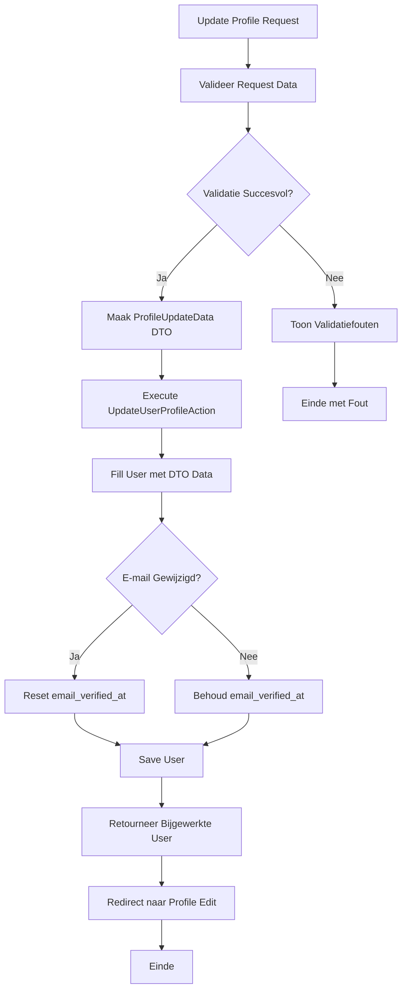

## Het Doel

Wanneer een gebruiker zijn profiel informatie wil bijwerken, gebeurt er meer dan alleen het updaten van naam en e-mail. Het systeem:

1. Valideert naam en e-mail
2. Update naam en e-mail in database
3. Reset e-mail verificatie status als e-mail is gewijzigd
4. Gebruiker moet e-mail opnieuw verifiëren na wijziging

Dit proces zorgt ervoor dat gebruikers hun profiel kunnen bijwerken en dat e-mail verificatie status correct wordt beheerd.

## De Flow



## Business Regels & Validaties

<AccordionGroup>
<Accordion title="Regel 1: Naam Validatie">
Naam is verplicht en mag maximaal 255 karakters zijn.

**Implementatie:**
```php src/Domain/Settings/Data/ProfileUpdateData.php
#[Required, Max(255)]
public string $name,
```

**Consequentie:**
- Lege namen worden afgewezen
- Namen langer dan 255 karakters worden afgewezen
</Accordion>

<Accordion title="Regel 2: E-mail Validatie">
E-mail moet geldig zijn en maximaal 255 karakters.

**Implementatie:**
```php src/Domain/Settings/Data/ProfileUpdateData.php
#[Required, Email, Max(255)]
public string $email,
```

**Consequentie:**
- Ongeldige e-mails worden afgewezen
- E-mails langer dan 255 karakters worden afgewezen
</Accordion>

<Accordion title="Regel 3: E-mail Verificatie Reset">
Als e-mail wordt gewijzigd, wordt email_verified_at gereset naar null.

**Implementatie:**
```php src/Domain/User/Actions/UpdateUserProfileAction.php
if ($user->isDirty('email')) {
    $user->email_verified_at = null;
}
```

**Consequentie:**
- Gebruiker moet e-mail opnieuw verifiëren na wijziging
- Beveiliging tegen ongeautoriseerde e-mail wijzigingen
</Accordion>

<Accordion title="Regel 4: Mass Assignment via Fill">
Gebruikt fill() voor veilige mass assignment.

**Implementatie:**
```php src/Domain/User/Actions/UpdateUserProfileAction.php
$user->fill($profileData->toArray());
```

**Consequentie:**
- Alleen fillable attributes worden geüpdatet
- Beveiliging tegen mass assignment vulnerabilities
</Accordion>
</AccordionGroup>

## Edge Cases

<Warning>
**Wat als e-mail al in gebruik is door andere gebruiker?**
Als e-mail uniek validatie wordt toegevoegd, wordt validatiefout getoond. Update wordt niet uitgevoerd. Momenteel wordt dit niet gecontroleerd in de Action.
</Warning>

<Warning>
**Wat als database update faalt?**
Als User save() faalt, wordt exception gegooid. Gebruiker ziet server error. Profiel wordt niet geüpdatet.
</Warning>

<Warning>
**Wat als gebruiker niet ingelogd is?**
Controller checkt authenticatie. Als niet ingelogd, wordt redirect naar login. UpdateUserProfileAction wordt niet uitgevoerd.
</Warning>

<Warning>
**Wat als e-mail niet wordt gewijzigd?**
Als alleen naam wordt gewijzigd, blijft email_verified_at ongewijzigd. Gebruiker hoeft e-mail niet opnieuw te verifiëren.
</Warning>
</AccordionGroup>

## QA & Test Scenario's

### Happy Path

**Scenario:** Gebruiker update profiel met nieuwe naam en e-mail
- **Verwachting:**
  - Request wordt gevalideerd
  - ProfileUpdateData DTO wordt aangemaakt
  - UpdateUserProfileAction update naam en e-mail
  - email_verified_at wordt gereset naar null
  - User wordt opgeslagen
  - Gebruiker wordt doorgestuurd naar profile edit pagina
  - Profiel is bijgewerkt
  - E-mail verificatie is vereist

### Edge Case 1: Alleen Naam Wijzigen

**Scenario:** Gebruiker wijzigt alleen naam, e-mail blijft hetzelfde
- **Verwachting:**
  - Request wordt gevalideerd
  - ProfileUpdateData DTO wordt aangemaakt
  - UpdateUserProfileAction update alleen naam
  - E-mail is niet gewijzigd (isDirty('email') = false)
  - email_verified_at blijft ongewijzigd
  - User wordt opgeslagen
  - Profiel is bijgewerkt
  - E-mail verificatie blijft geldig

### Edge Case 2: Ongeldig E-mail Formaat

**Scenario:** Gebruiker gebruikt ongeldig e-mail formaat
- **Verwachting:**
  - Validatie faalt op e-mail veld
  - Foutmelding wordt getoond: "The email must be a valid email address"
  - UpdateUserProfileAction wordt niet uitgevoerd
  - Profiel wordt niet geüpdatet
  - Gebruiker blijft op profile edit pagina

### Edge Case 3: Lege Verplichte Velden

**Scenario:** Gebruiker laat naam of e-mail leeg
- **Verwachting:**
  - Validatie faalt op verplichte velden
  - Foutmeldingen worden getoond: "The name field is required" en "The email field is required"
  - UpdateUserProfileAction wordt niet uitgevoerd
  - Profiel wordt niet geüpdatet
  - Gebruiker blijft op profile edit pagina

## Aanroep Locaties

<CardGroup cols={2}>
<Card title="Portal Controller" icon="code">
  **Controller:**
  ```php
  src/App/Portal/Settings/Controllers/ProfileController.php
  ```
  
  **Methode:** `update()`
  
  **Route:** `PUT /profile` of `PATCH /profile`
  
  **Guard:** `web` (auth middleware)
</Card>
</CardGroup>

## Betrokken Code

<CardGroup cols={2}>
<Card title="UpdateUserProfileAction" icon="code" href="/domains/user#updateuserprofileaction">
  De Action die de profiel update uitvoert
</Card>

<Card title="ProfileUpdateData" icon="code" href="/domains/settings#profileupdatedata">
  DTO voor profiel update gegevens
</Card>

<Card title="User Domain" icon="sitemap" href="/domains/user">
  Volledige documentatie van het User domein
</Card>

<Card title="Settings Domain" icon="sitemap" href="/domains/settings">
  Volledige documentatie van het Settings domein
</Card>
</CardGroup>
