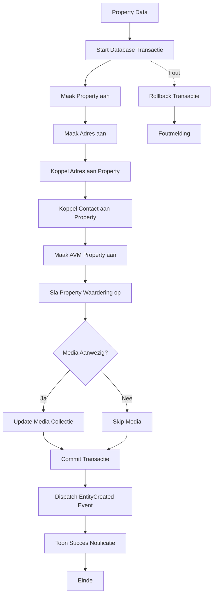

## Het Doel

Wanneer een nieuwe property wordt aangemaakt, gebeurt er veel meer dan alleen het opslaan van basisgegevens. Het systeem:

1. Maakt de **Property** aan met alle technische details
2. Creëert en koppelt een **Adres** aan de property
3. Koppelt het **Contact** (eigenaar) aan de property
4. Maakt een **AVM Property** aan voor automatische waarderingen
5. Slaat de eerste **Property Waardering** op
6. Werkt de **Media Collectie** bij (afbeeldingen)
7. Stuurt een **Event** om andere delen van het systeem te informeren

Dit proces zorgt ervoor dat een property direct volledig functioneel is met alle benodigde data en relaties, klaar voor gebruik in het systeem.

## De Flow



## Business Regels & Validaties

<AccordionGroup>
<Accordion title="Regel 1: Transactie Integriteit">

Alle property gerelateerde data wordt binnen één database transactie aangemaakt. Dit garandeert dat alle data consistent is.

**Implementatie:**
- Gebruikt `DB::beginTransaction()` en `DB::commit()`
- Alle stappen worden uitgevoerd voordat commit

**Consequentie:**
- Geen property zonder adres
- Geen property zonder contact
- Data integriteit is gegarandeerd

</Accordion>

<Accordion title="Regel 2: Adres Creatie">

Het adres wordt altijd aangemaakt, ook als niet alle adresgegevens zijn opgegeven.

**Implementatie:**
```php
(new CreateAddressAction())->execute($propertyData->address, $property);
```

**Consequentie:**
- Property heeft altijd een adres (ook al is het incompleet)
- Adres kan later worden aangevuld

</Accordion>

<Accordion title="Regel 3: AVM Property Creatie">

Voor elke property wordt automatisch een AVM Property aangemaakt voor waarderingen.

**Implementatie:**
```php
$avmProperty = (new CreateAvmPropertyAction())->execute($propertyData, $property);
```

**Consequentie:**
- Property kan automatische waarderingen ontvangen
- AVM data wordt gescheiden opgeslagen

</Accordion>

<Accordion title="Regel 4: Initiele Waardering">

Bij het aanmaken van een property wordt direct een initiële waardering opgeslagen.

**Implementatie:**
```php
(new StorePropertyValuationAction())->execute($propertyData, $avmProperty);
```

**Consequentie:**
- Property heeft direct een waardering
- Waardering kan later worden bijgewerkt

</Accordion>

<Accordion title="Regel 5: Media Collectie Update">

Media wordt alleen bijgewerkt indien media data aanwezig is in de PropertyData.

**Implementatie:**
```php
$media = $propertyData->media;
(new UpdatePropertyMediaCollectionAction())->execute($media, $property);
```

**Consequentie:**
- Media is optioneel bij property creatie
- Media kan later worden toegevoegd

</Accordion>

<Accordion title="Regel 6: Entity Created Event">

Na succesvolle creatie wordt een EntityCreated event gedispatched.

**Implementatie:**
```php
EntityCreated::dispatch($property);
```

**Consequentie:**
- Andere delen van het systeem worden geïnformeerd
- Automatische interactie logging kan worden getriggerd

</Accordion>
</AccordionGroup>

## Edge Cases

<Warning>
**Wat als het Contact niet bestaat?**
Het Contact moet bestaan voordat een Property wordt aangemaakt. Als `contact_id` verwijst naar een niet-bestaand Contact, zal de database foreign key constraint falen en wordt de transactie teruggedraaid.
</Warning>

<Warning>
**Wat als de AVM service niet beschikbaar is?**
De AVM Property wordt aangemaakt, maar de waardering kan niet worden opgehaald. De Property wordt wel aangemaakt, maar zonder initiële waardering. De waardering kan later handmatig worden toegevoegd of via een background job.
</Warning>

<Warning>
**Wat als media upload faalt?**
Als media upload faalt tijdens de property creatie, wordt de transactie niet teruggedraaid. De Property wordt aangemaakt zonder media. Media kan later handmatig worden toegevoegd.
</Warning>

<Warning>
**Wat als adresgegevens incompleet zijn?**
Het adres wordt aangemaakt met beschikbare gegevens. Ontbrekende velden zijn null. Dit is toegestaan, maar kan leiden tot incomplete data. Adres kan later worden aangevuld.
</Warning>

## QA & Test Scenario's

### Happy Path

**Scenario:** Property wordt aangemaakt met volledige gegevens, adres, contact en media
- **Verwachting:**
  - Property wordt aangemaakt met alle gegevens
  - Adres wordt aangemaakt en gekoppeld
  - Contact wordt gekoppeld
  - AVM Property wordt aangemaakt
  - Initiele waardering wordt opgeslagen
  - Media collectie wordt bijgewerkt
  - EntityCreated event wordt gedispatched
  - Succes notificatie wordt getoond

### Edge Case 1: Ontbrekend Contact

**Scenario:** Property wordt aangemaakt met niet-bestaand contact_id
- **Verwachting:**
  - Database foreign key constraint fout
  - Transactie wordt teruggedraaid
  - Geen Property wordt aangemaakt
  - Foutmelding wordt getoond

### Edge Case 2: Incompleet Adres

**Scenario:** Property wordt aangemaakt met incompleet adres (bijv. alleen straat, geen postcode)
- **Verwachting:**
  - Property wordt aangemaakt
  - Adres wordt aangemaakt met beschikbare gegevens
  - Ontbrekende velden zijn null
  - Geen fout, maar incomplete data

### Edge Case 3: Zonder Media

**Scenario:** Property wordt aangemaakt zonder media
- **Verwachting:**
  - Property wordt aangemaakt
  - Media stap wordt overgeslagen
  - Property heeft geen media collectie
  - Geen fout

### Edge Case 4: AVM Service Fout

**Scenario:** Property wordt aangemaakt maar AVM service is onbeschikbaar
- **Verwachting:**
  - Property wordt aangemaakt
  - AVM Property creatie kan falen
  - Afhankelijk van implementatie: fout of lege AVM Property
  - Waardering wordt mogelijk niet opgeslagen

### Edge Case 5: Media Upload Fout

**Scenario:** Property wordt aangemaakt maar media upload faalt
- **Verwachting:**
  - Property wordt aangemaakt
  - Adres, Contact, AVM worden gekoppeld
  - Media upload faalt (fout wordt gelogd)
  - Property heeft geen media
  - Geen transactie rollback

## Aanroep Locaties

**BELANGRIJK:** Documenteer alle controllers en endpoints vanwaar deze flow wordt aangeroepen. Dit helpt developers om te begrijpen waar de business logica wordt gebruikt.

Zoek in `src/App` naar alle plaatsen waar de Action wordt aangeroepen en documenteer:
- Controller pad (bijv. `src/App/CRM/Contacts/Controllers/ContactsController.php`)
- Methode naam (bijv. `store()`, `update()`, `accept()`)
- Route (bijv. `POST /crm/contacts`, `PUT /crm/registrations/{registration}/accept`)
- Guard (bijv. `crm`, `portal`)
- Optioneel: Code snippet van de implementatie

**Voorbeeld voor één controller:**

<CardGroup cols={2}>
<Card title="CRM Controller" icon="code">
  **Controller:**
  ```php
  src/App/CRM/Contacts/Controllers/ContactsController.php
  ```
  
  **Methode:** `store()`
  
  **Route:** `POST /crm/contacts`
  
  **Guard:** `crm`
</Card>

<Card title="Implementatie" icon="code">
  ```php
  public function store(
      ContactCreateData $contactCreateData, 
      CreateContactAction $createContactAction
  ): RedirectResponse {
      $contact = $createContactAction->execute($contactCreateData);
      return redirect()->back()->with('newEntry', $contact);
  }
  ```
</Card>
</CardGroup>

**Voorbeeld voor meerdere controllers:**

<CardGroup cols={2}>
<Card title="CRM Controller" icon="code">
  **Controller:**
  ```php
  src/App/CRM/Properties/Controllers/PropertiesController.php
  ```
  
  **Methode:** `store()`
  
  **Route:** `POST /crm/properties`
  
  **Guard:** `crm`
</Card>

<Card title="Portal Controller" icon="code">
  **Controller:**
  ```php
  src/App/Portal/Properties/Controllers/ClientPropertiesController.php
  ```
  
  **Methode:** `store()`
  
  **Route:** `POST /portal/properties`
  
  **Guard:** `portal`
</Card>
</CardGroup>

**Tip:** Gebruik `grep` of codebase search om alle aanroepen te vinden:
```bash
grep -r "CreateContactAction" src/App
```

## Betrokken Code

<CardGroup cols={2}>
<Card title="CreatePropertyAction" icon="code" href="/domains/properties#createpropertyaction">
  De Action die de volledige flow uitvoert
</Card>

<Card title="CreateAddressAction" icon="code" href="/domains/address#createaddressaction">
  Action voor het aanmaken van het Adres
</Card>

<Card title="CreateAvmPropertyAction" icon="code" href="/domains/properties">
  Action voor het aanmaken van AVM Property
</Card>

<Card title="Properties Domain" icon="sitemap" href="/domains/properties">
  Volledige documentatie van het Properties domein
</Card>
</CardGroup>

