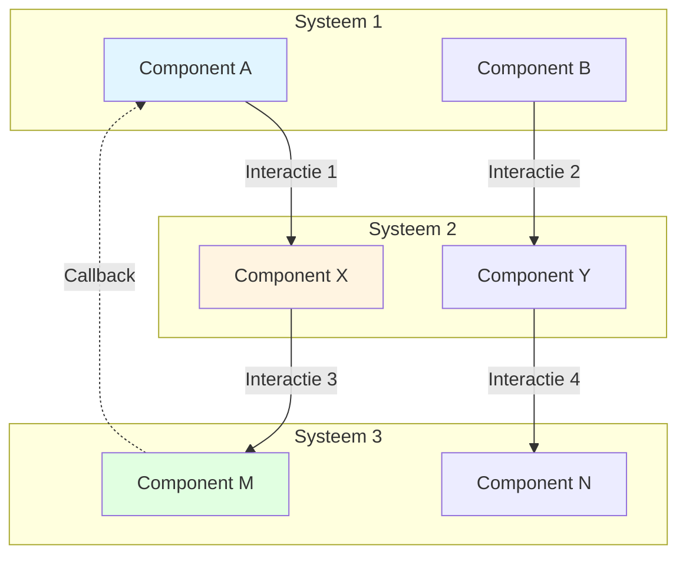
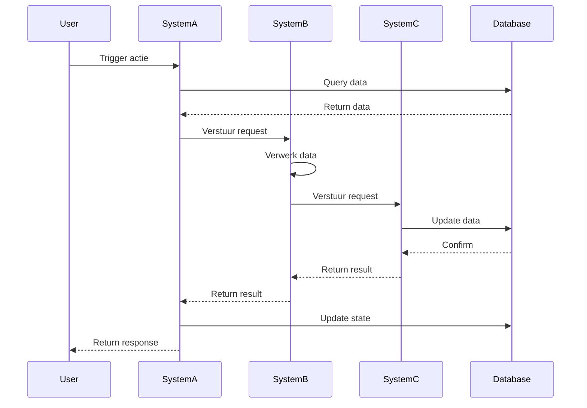

## Scope & Context

**BELANGRIJK:** Deze documentatie behandelt een specifieke case waarbij meerdere systemen nauw met elkaar interacteren. De scope is beperkt tot:

- **Primaire Systemen/Componenten:** [Lijst van de belangrijkste systemen die betrokken zijn]
- **Interactie Scope:** [Beschrijving van welke interacties worden gedocumenteerd]
- **Gebruik Case:** [Beschrijving van wanneer deze case relevant is]

<Note>
**Waarom deze specifieke documentatie?**
Deze case vereist extra detail omdat [reden waarom deze case complex is of speciale aandacht nodig heeft]. Deze documentatie gaat dieper in op de interacties dan de standaard domain of logic documentatie.
</Note>

## Systeem Overzicht

Geef een overzicht van alle betrokken systemen, componenten of modules en hun rol in deze specifieke case.

<CardGroup cols={2}>
<Card title="Systeem 1: [Naam]" icon="sitemap">
  **Rol:** [Wat doet dit systeem in deze case]
  
  **Verantwoordelijkheden:**
  - [Verantwoordelijkheid 1]
  - [Verantwoordelijkheid 2]
  - [Verantwoordelijkheid 3]
  
  **Locatie:** `[pad naar code/domain]`
</Card>

<Card title="Systeem 2: [Naam]" icon="sitemap">
  **Rol:** [Wat doet dit systeem in deze case]
  
  **Verantwoordelijkheden:**
  - [Verantwoordelijkheid 1]
  - [Verantwoordelijkheid 2]
  - [Verantwoordelijkheid 3]
  
  **Locatie:** `[pad naar code/domain]`
</Card>

<Card title="Systeem 3: [Naam]" icon="sitemap">
  **Rol:** [Wat doet dit systeem in deze case]
  
  **Verantwoordelijkheden:**
  - [Verantwoordelijkheid 1]
  - [Verantwoordelijkheid 2]
  - [Verantwoordelijkheid 3]
  
  **Locatie:** `[pad naar code/domain]`
</Card>
</CardGroup>

## Interactie Diagram

Een gedetailleerd diagram dat alle interacties tussen de systemen toont.



## Gedetailleerde Interacties

Documenteer elke interactie tussen systemen in detail.

<AccordionGroup>
<Accordion title="Interactie 1: [Systeem A] → [Systeem B]">

**Trigger:** [Wanneer gebeurt deze interactie?]

**Data Flow:**
- **Input:** [Wat wordt er verstuurd]
- **Output:** [Wat wordt er teruggegeven]
- **Side Effects:** [Welke neveneffecten zijn er?]

**Implementatie:**
```php
// Voorbeeld code pad
src/Domain/SystemA/Actions/InteractWithSystemBAction.php
```

**Timing:** [Wanneer in de flow gebeurt dit?]

**Foutafhandeling:** [Wat gebeurt er bij fouten?]

**Afhankelijkheden:** [Waar is deze interactie van afhankelijk?]

</Accordion>

<Accordion title="Interactie 2: [Systeem B] → [Systeem C]">

**Trigger:** [Wanneer gebeurt deze interactie?]

**Data Flow:**
- **Input:** [Wat wordt er verstuurd]
- **Output:** [Wat wordt er teruggegeven]
- **Side Effects:** [Welke neveneffecten zijn er?]

**Implementatie:**
```php
// Voorbeeld code pad
src/Domain/SystemB/Actions/InteractWithSystemCAction.php
```

**Timing:** [Wanneer in de flow gebeurt dit?]

**Foutafhandeling:** [Wat gebeurt er bij fouten?]

**Afhankelijkheden:** [Waar is deze interactie van afhankelijk?]

</Accordion>

<Accordion title="Interactie 3: [Systeem C] → [Systeem A] (Callback)">

**Trigger:** [Wanneer gebeurt deze interactie?]

**Data Flow:**
- **Input:** [Wat wordt er verstuurd]
- **Output:** [Wat wordt er teruggegeven]
- **Side Effects:** [Welke neveneffecten zijn er?]

**Implementatie:**
```php
// Voorbeeld code pad
src/Domain/SystemC/Events/SystemCEvent.php
```

**Timing:** [Wanneer in de flow gebeurt dit?]

**Foutafhandeling:** [Wat gebeurt er bij fouten?]

**Afhankelijkheden:** [Waar is deze interactie van afhankelijk?]

</Accordion>
</AccordionGroup>

## Volledige Flow

Een complete flow die alle stappen en interacties toont.



## Data Synchronisatie

Als systemen data delen of synchroniseren, documenteer dit hier.

<Warning>
**Data Consistency:**
[Belangrijke waarschuwingen over data consistentie tussen systemen]
</Warning>

### Gedeelde Data Structuren

<ParamField path="[veld naam]" type="[type]" required>
  [Beschrijving van het veld en hoe het wordt gedeeld tussen systemen]
</ParamField>

### Synchronisatie Regels

<AccordionGroup>
<Accordion title="Regel 1: [Synchronisatie Regel]">

[Uitleg van de regel]

**Implementatie:**
```php
// Code voorbeeld
```

**Consequentie:**
- [Gevolg 1]
- [Gevolg 2]

</Accordion>
</AccordionGroup>

## Afhankelijkheden & Constraints

Documenteer alle afhankelijkheden tussen systemen.

<CardGroup cols={2}>
<Card title="Systeem A Afhankelijkheden" icon="link">
  **Vereist van Systeem B:**
  - [Afhankelijkheid 1]
  - [Afhankelijkheid 2]
  
  **Vereist van Systeem C:**
  - [Afhankelijkheid 1]
</Card>

<Card title="Systeem B Afhankelijkheden" icon="link">
  **Vereist van Systeem A:**
  - [Afhankelijkheid 1]
  
  **Vereist van Systeem C:**
  - [Afhankelijkheid 1]
  - [Afhankelijkheid 2]
</Card>
</CardGroup>

## Edge Cases & Foutscenario's

Specifieke edge cases die ontstaan door de interacties tussen systemen.

<Warning>
**Edge Case 1: [Titel]**

**Scenario:** [Beschrijving van het scenario]

**Impact op Systemen:**
- **Systeem A:** [Wat gebeurt er met systeem A]
- **Systeem B:** [Wat gebeurt er met systeem B]
- **Systeem C:** [Wat gebeurt er met systeem C]

**Oplossing:** [Hoe wordt dit opgelost of afgehandeld]
</Warning>

<Warning>
**Edge Case 2: [Titel]**

**Scenario:** [Beschrijving van het scenario]

**Impact op Systemen:**
- **Systeem A:** [Wat gebeurt er met systeem A]
- **Systeem B:** [Wat gebeurt er met systeem B]
- **Systeem C:** [Wat gebeurt er met systeem C]

**Oplossing:** [Hoe wordt dit opgelost of afgehandeld]
</Warning>

## Test Scenario's

Specifieke test scenario's voor deze case.

### Happy Path: Volledige Interactie

**Scenario:** Alle systemen werken correct en de volledige flow wordt uitgevoerd

**Stappen:**
1. [Stap 1]
2. [Stap 2]
3. [Stap 3]

**Verwachting:**
- **Systeem A:** [Verwachting]
- **Systeem B:** [Verwachting]
- **Systeem C:** [Verwachting]

### Edge Case 1: Systeem B Faalt

**Scenario:** Systeem B faalt tijdens de interactie

**Stappen:**
1. [Stap 1]
2. [Stap 2 - Systeem B faalt hier]
3. [Stap 3]

**Verwachting:**
- **Systeem A:** [Verwachting - rollback?]
- **Systeem B:** [Verwachting - error state?]
- **Systeem C:** [Verwachting - niet aangeroepen?]

### Edge Case 2: Partiële Data

**Scenario:** Systeem A heeft incomplete data voor Systeem B

**Stappen:**
1. [Stap 1]
2. [Stap 2]
3. [Stap 3]

**Verwachting:**
- **Systeem A:** [Verwachting]
- **Systeem B:** [Verwachting - validatie?]
- **Systeem C:** [Verwachting]

## Betrokken Code

Links naar alle relevante code voor deze specifieke case.

<CardGroup cols={2}>
<Card title="Systeem A - Main Action" icon="code" href="/domains/systema#action">
  [Beschrijving]
</Card>

<Card title="Systeem B - Main Action" icon="code" href="/domains/systemb#action">
  [Beschrijving]
</Card>

<Card title="Systeem C - Main Action" icon="code" href="/domains/systemc#action">
  [Beschrijving]
</Card>

<Card title="Gedeelde DTO's" icon="code" href="/domains/shared#dto">
  [Beschrijving]
</Card>
</CardGroup>

## Gerelateerde Documentatie

Links naar gerelateerde documentatie die relevant is voor deze case.

<CardGroup cols={2}>
<Card title="Domain: Systeem A" icon="sitemap" href="/domains/systema">
  Volledige documentatie van Systeem A
</Card>

<Card title="Domain: Systeem B" icon="sitemap" href="/domains/systemb">
  Volledige documentatie van Systeem B
</Card>

<Card title="Logic: [Gerelateerde Flow]" icon="workflow" href="/logic/related-flow">
  Gerelateerde business logic flow
</Card>
</CardGroup>

